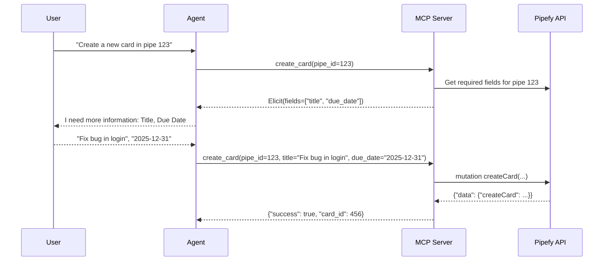

# MCP server for Pipefy

<p align="center">
  <strong>Pipefy MCP is an open-source MCP server that lets your IDE safely create cards, update field information, and use any Pipefy resource — all with built-in safety controls.</strong>
</p>

<p align="center">
  🚧 <strong>Alpha Release:</strong> Building in public. <br>
  📢 Share your feedback on GitHub issues or at dev@pipefy.com.
</p>

<p align="center">
  <a href="https://github.com/gbrlcustodio/pipefy-mcp-server/actions"></a>
  <a href="https://www.python.org/downloads/"></a>
  <a href="https://github.com/astral-sh/uv"></a>
  <a href="https://modelcontextprotocol.io/introduction"></a>
  <a href="LICENSE"></a>
</p>

> **⚠️ Disclaimer:** This is a "Build in public" project primarily aimed at developer workflows. It is **not** the official, supported Pipefy integration for external enterprise clients, but rather a tool to facilitate the development experience for those who use Pipefy for task management.

## Table of contents
<p align="center">
  <a href="#feature-overview">Feature overview</a> •
  <a href="#mcp-tools-at-a-glance">MCP tools at a glance</a> •
  <a href="#getting-started">Getting started</a> •
  <a href="#usage-with-cursor">Usage with Cursor</a> •
  <a href="#development--testing">Development & Testing</a> •
  <a href="#contributing">Contributing</a>
</p>

## Feature Overview

This server exposes Pipefy operations as **MCP tools** for LLMs (e.g. in Cursor). The codebase uses a facade over domain services (pipes, cards, pipe configuration, **database tables**, **pipe/table relations and card links**, **traditional automations** (event/action rules), schema introspection), with GraphQL documents in dedicated modules.

**Discoverability:** Each tool has a docstring consumed by clients for routing and parameters—treat those as the source of truth for arguments. This README summarizes **what exists** and **cross-cutting behavior** (pagination, destructive flows, introspection); it does not duplicate every parameter.

---

## MCP tools at a glance

### Reads & search

| Area | Tools |
|------|--------|
| **Pipe** | `get_pipe`, `get_start_form_fields`, `get_phase_fields` (each phase field includes **`id`**, **`internal_id`**, **`uuid`**), `get_pipe_members`, `search_pipes` |
| **Cards** | `get_cards`, `get_card`, `find_cards` — use `include_fields` when you need custom field name/value on each card. |
| **Database tables** | `get_table`, `get_tables`, `get_table_records`, `get_table_record`, `find_records` |
| **Relations** | `get_pipe_relations`, `get_table_relations` |
| **AI agents** | `get_ai_agent`, `get_ai_agents` — list or load agents by pipe **`repo_uuid`** (pipe UUID from `get_pipe`). |
| **Automations (traditional)** | `get_automation`, `get_automations`, `get_automation_actions`, `get_automation_events` |

### Pipe building (structure & labels)

Create and update pipes, phases, phase fields, and labels. **Field types** are not validated locally—use **`introspect_type`** (e.g. on `CreatePhaseFieldInput`) for allowed values.

Successful mutations return a **structured** `result` (GraphQL payload). Most write tools support optional **`debug=true`** on errors (GraphQL codes + `correlation_id`). **`extra_input`** merges extra API keys; keys that would duplicate primary arguments are ignored (same pattern as table-field tools).

| Group | Tools | Notes |
|-------|--------|--------|
| Pipe | `create_pipe`, `update_pipe`, `delete_pipe`, `clone_pipe` | **`delete_pipe`**: two-step — preview first, then `confirm=true` after user approval. |
| Phase | `create_phase`, `update_phase`, `delete_phase` | Destructive deletes: confirm with the user. |
| Phase field | `create_phase_field`, `update_phase_field`, `delete_phase_field` | `field_type` maps to API `type`; `field_id` may be a slug or numeric ID. |
| Field condition | `create_field_condition`, `update_field_condition`, `delete_field_condition` | **`create_field_condition`** maps to **`createFieldConditionInput`**: **`phase_id`**, **`condition`**, **`actions`** (see Field condition tools). **`delete_field_condition`** is **`destructiveHint=True`** (confirm first). |
| Label | `create_label`, `update_label`, `delete_label` | **`color`** must be a **hex** string (e.g. `#FF0000`), not a name. |

### Cards (lifecycle & comments)

| Tool | Role |
|------|------|
| `create_card` | Create a card; may use **elicitation** to ask the user for required fields mid-call. |
| `add_card_comment`, `update_comment`, `delete_comment` | Comments (`text` length limits enforced). |
| `move_card_to_phase` | Move card to another phase. |
| `update_card_field` | Single-field update (`updateCardField`). |
| `update_card` | Metadata (`title`, assignees, labels, due date) **and/or** multiple custom fields via `field_updates`. |
| `delete_card` | **Two-step**: default preview; `confirm=true` after explicit user confirmation. |

**Choosing card updates:** `update_card_field` = one field, full replacement. `update_card` + `field_updates` = several custom fields at once. `update_card` with attribute args = metadata (combinable with `field_updates`).

<details>
<summary><strong>Optional:</strong> sequence diagram for <code>create_card</code> + elicitation</summary>



</details>

### Database tables (reference data)

**15 tools** for org **Database Tables**: metadata, rows (records), and **schema columns** (table fields). Same conventions as pipe building: **`introspect_type`** on inputs such as `CreateTableFieldInput` / `UpdateTableFieldInput`, **`debug=true`** on mutations, **`extra_input`** where the tool exposes it.

| Domain | Tools |
|--------|--------|
| **Read** | `get_table`, `get_tables`, `get_table_records`, `get_table_record`, `find_records` |
| **Table CRUD** | `create_table`, `update_table`, `delete_table` — **`delete_table`** uses preview + `confirm=true` (like `delete_pipe`). |
| **Record CRUD** | `create_table_record`, `update_table_record`, `delete_table_record`, `set_table_record_field_value` |
| **Field CRUD** | `create_table_field`, `update_table_field`, `delete_table_field` — schema columns; **`delete_table_field`** is destructive (confirm with the user). |

**Pagination:** `get_table_records` and `find_records` support **`first`** / **`after`**. Read `pageInfo.hasNextPage` and `pageInfo.endCursor` from the tool response and pass `after=endCursor` for the next page (default page size for listing records is 50; caps apply—see tool docstrings).

### Connections & relation tools

**Six tools** link processes and cards across workflows:

- **Pipe relations** define parent/child structure between pipes (who connects to whom, constraints, auto-fill). Use **`get_pipe_relations`** on a pipe to list relation IDs and metadata.
- **Card relations** connect individual cards through an existing pipe relation: pass **`source_id`** = that pipe relation’s ID (from `get_pipe_relations`). Default **`sourceType`** is `PipeRelation`; use **`extra_input`** (e.g. `sourceType: Field`) when the API requires a field-based link—see **`introspect_type`** on `CreateCardRelationInput`.
- **Table relations** in GraphQL are loaded by **table-relation ID**, not by database table ID: **`get_table_relations`** takes a non-empty list of those IDs (root `table_relations` query).

| Tool | Read-only | Role |
|------|-----------|------|
| `get_pipe_relations` | Yes | Lists parent/child pipe relations for a pipe. |
| `get_table_relations` | Yes | Batch-loads table relations by **relation** ID list. |
| `create_pipe_relation` | No | Creates a parent–child relation between two pipes; optional **`extra_input`** (camelCase) for `CreatePipeRelationInput`. |
| `update_pipe_relation` | No | Updates relation config; **`name`** required; optional **`extra_input`** for other `UpdatePipeRelationInput` keys. |
| `delete_pipe_relation` | No | Permanently deletes a pipe relation (**`destructiveHint=True`** — confirm with the user first). |
| `create_card_relation` | No | Links a child card to a parent card via **`source_id`** (pipe relation ID); optional **`extra_input`** for `CreateCardRelationInput`. Mutations support **`debug=true`** on errors like other write tools. |

### Traditional automation tools (rules engine)

**Seven tools** manage Pipefy **traditional automations**: if/then rules bound to a pipe (trigger events and actions via the **standard GraphQL** API). These are **not** the same as **AI automations** in the next section—those are prompt-driven and use the **internal** API (`create_ai_automation`, etc.).

**Tip:** Call **`get_automation_events`** (global event catalog in the current API) and **`get_automation_actions`** with the target pipe (**`repoId`**) before **`create_automation`** to pick valid **`trigger_id`** / **`action_id`** values. For full rule shape, use **`get_automation`**. Writes accept optional **`extra_input`** (camelCase API keys) and **`debug=true`** on errors (GraphQL codes + `correlation_id`), like relation tools.

| Tool | Read-only | Role |
|------|-----------|------|
| `get_automation` | Yes | Loads one rule by ID (trigger, actions, `active`). |
| `get_automations` | Yes | Lists rules; optional **`organization_id`** and/or **`pipe_id`**. |
| `get_automation_actions` | Yes | Catalog of action types for a pipe (IDs and field metadata). |
| `get_automation_events` | Yes | Catalog of trigger event definitions (global list; tool still takes `pipe_id` for context). |
| `create_automation` | No | Creates a rule: **`pipe_id`**, **`name`**, **`trigger_id`**, **`action_id`**; **`active`** defaults to **true** (enabled). Set **`active: false`** to create disabled, or use **`extra_input.active`** to override. Toggle later with **`update_automation`**. |
| `update_automation` | No | Patches a rule via **`extra_input`** (`UpdateAutomationInput` fields). |
| `delete_automation` | No | Permanently deletes a rule (**`destructiveHint=True`** — irreversible; confirm with the user first). |

### AI automations & agents

**AI automations** (below) are separate from **traditional** rules above.

| Tool | Purpose |
|------|---------|
| `create_ai_automation` | Prompt-driven automation writing to one or more card fields (AI must be enabled on the pipe in Pipefy). |
| `update_ai_automation` | Change name, `active`, prompt, `field_ids`, or `condition`. |
| `create_ai_agent` | Create an agent on a pipe; **`repo_uuid`** is the pipe UUID from `get_pipe`, not the URL numeric id alone. |
| `update_ai_agent` | Replaces full agent config; send the **complete** `behaviors` list (1–5). |
| `toggle_ai_agent_status` | Enable/disable without resending configuration. |

#### AI Agent read & delete

Inspect and remove agents without changing Pipefy’s UI. Use **`get_ai_agents`** with the pipe’s **`uuid`** (same as **`repo_uuid`** when creating an agent) before **`create_ai_agent`** to avoid duplicates.

| Tool | Read-only | Role |
|------|-----------|------|
| `get_ai_agent` | Yes | Loads one agent by UUID (**`uuid`**): name, instruction, behaviors. |
| `get_ai_agents` | Yes | Lists agents for a pipe (**`repo_uuid`** = pipe UUID). |
| `delete_ai_agent` | No | Permanently deletes an agent (**`destructiveHint=True`** — irreversible; confirm with the user first). **`uuid`** is the agent id. |

### Field condition tools

**Three tools** configure **conditional visibility** on **phase fields** (standard GraphQL mutations). **`create_field_condition`** sends **`phaseId`**, **`condition`** (`ConditionInput`), and **`actions`** (`FieldConditionActionInput` list); action entries use **`phaseFieldId`** with the target field’s **`internal_id`** from **`get_phase_fields`** (not the slug **`id`**). The tool rejects an empty **`condition`**, an empty **`expressions`** list inside **`condition`**, and if **`phaseFieldId`** looks like a **slug**, it returns an error pointing here instead of calling the API.

- Use **`introspect_type('createFieldConditionInput')`** / **`UpdateFieldConditionInput`** for optional keys in **`extra_input`** when you need uncommon fields.
- **`create_field_condition`** and **`update_field_condition`** accept optional **`extra_input`** and **`debug=true`** on errors (GraphQL codes + `correlation_id`), like other pipe-config writes.

| Tool | Read-only | Role |
|------|-----------|------|
| `create_field_condition` | No | Creates a rule: **`phase_id`**, **`condition`** (dict), **`actions`** (list of dicts), optional **`extra_input`**. |
| `update_field_condition` | No | Patches an existing rule: **`condition_id`** and at least one of **`condition`**, **`actions`**, or **`extra_input`** (same shapes as create for **`condition`** / **`actions`**). |
| `delete_field_condition` | No | Deletes a rule (**`destructiveHint=True`** — confirm with the user first). |

#### Field conditions cookbook (tools-first happy path)

Use this flow for standard **show/hide** rules instead of **`execute_graphql`** or deep introspection.

1. **`get_pipe(pipe_id)`** — Note the **`phases`** list and the numeric **`id`** of the phase you are configuring.
2. **`get_phase_fields(phase_id)`** — For the field that **triggers** the rule and the field whose visibility you **control**, copy **`internal_id`** (and optionally **`uuid`**) from each row. Do **not** use the slug **`id`** for **`phaseFieldId`** in **`actions`**.
3. Build **`condition`** as a **`ConditionInput`** object: a non-empty dict with **`expressions`** (list of **`ConditionExpressionInput`**) and usually **`expressions_structure`** (list of lists grouping by **`structure_id`**). Each expression needs **`field_address`**, **`operation`**, **`value`**, and **`structure_id`**. Do **not** send **`id`** in expressions on create — the tool strips it automatically because the API treats it as a persisted primary key.
4. Build **`actions`** — at least one object such as **`{ "phaseFieldId": "<target internal_id>", "whenEvaluator": true, "actionId": "hide" }`**. **`actionId`** is required: use **`hide`** or **`show`** (legacy **`hidden`** is mapped to **`hide`** automatically).
5. Call **`create_field_condition`** with **`phase_id`**, **`condition`**, **`actions`**, and optional **`extra_input`** (e.g. **`name`**, **`index`**).
6. Adjust with **`update_field_condition`** or remove with **`delete_field_condition`** when needed.

**Minimal example** (replace placeholders with IDs from **`get_pipe`** / **`get_phase_fields`**):

```json
{
  "phase_id": "YOUR_PHASE_NUMERIC_ID",
  "condition": {
    "expressions": [
      {
        "field_address": "TRIGGER_FIELD_INTERNAL_ID",
        "operation": "equals",
        "value": "Yes",
        "structure_id": "s1"
      }
    ],
    "expressions_structure": [["s1"]]
  },
  "actions": [
    {
      "phaseFieldId": "TARGET_FIELD_INTERNAL_ID",
      "whenEvaluator": true,
      "actionId": "hide"
    }
  ],
  "extra_input": {
    "name": "Hide target when trigger is Yes"
  }
}
```

**When to use introspection / raw GraphQL:** **`introspect_type`**, **`introspect_mutation`**, and **`execute_graphql`** are for **edge cases**, **schema discovery**, or **incidents**—not the default path for building standard field conditions. Prefer **`get_phase_fields`** + the tools above first.

**Known gaps (live API):** Introspection does not document `ConditionExpressionInput.operation` values or full `expressions_structure` semantics. The tool strips **`id`** from expressions on create (persisted PK, not a client token) and maps legacy **`actionId` `hidden`** to **`hide`**. See **[Field conditions API limitations](.cursor/dev-planning/specs/ai-agents-field-conditions/FIELD_CONDITIONS_API_LIMITATIONS.md)** for detailed notes.

### Introspection & raw GraphQL

When the schema shifts or no dedicated tool exists: **discovery** tools plus a **last-resort** executor (same OAuth client as everything else).

| Tool | Read-only hint | Purpose |
|------|----------------|--------|
| `introspect_type` | Yes | Type shape: `fields`, `inputFields`, `enumValues`. |
| `introspect_mutation` | Yes | Mutation arguments and return type. |
| `search_schema` | Yes | Keyword search on type names/descriptions. |
| `execute_graphql` | **No** | Arbitrary document (syntax-checked). **Prefer dedicated tools.** |

Responses: `success` / `result` or `error`; transport GraphQL errors are surfaced clearly.

## Getting Started

### Prerequisites
Installing the server requires the following on your system:
- Python 3.11+
- A **Pipefy Service Account Token** (Generate in Admin Panel > Service Accounts).
- Remember to add the service account to the pipe you want the AI to use.

### Installation
We recommend using `uv` for dependency management. Ensure it's [installed](https://docs.astral.sh/uv/getting-started/installation/#__tabbed_1_1).

```sh
# Clone the repository
git clone https://github.com/gbrlcustodio/pipefy-mcp-server.git
cd pipefy-mcp-server

# Sync dependencies
uv sync
```
## Usage with Cursor
To use this with Cursor, you need to register it as an MCP server in your settings.

1. Open Cursor.
1. Navigate to Cursor Settings > Features > MCP Servers.
1. Click + Add New MCP Server.
1. Fill in the details as shown in the configuration block below.

```json
{
    "mcpServers": {
        "pipefy": {
            "cwd": "/absolute/path/to/pipefy-mcp-server",
            "command": "uv",
            "args": [
                "run",
                "--directory",
                ".",
                "pipefy-mcp-server"
            ],
            "env": {
                "PIPEFY_GRAPHQL_URL": "https://app.pipefy.com/graphql",
                "PIPEFY_OAUTH_URL": "https://app.pipefy.com/oauth/token",
                "PIPEFY_OAUTH_CLIENT": "<SERVICE_ACCOUNT_CLIENT_ID>",
                "PIPEFY_OAUTH_SECRET": "<SERVICE_ACCOUNT_CLIENT_SECRET>"
            }
        }
    }
}
```

## Development & Testing

### Running Tests

```bash
# Run all tests
uv run pytest

# Run with coverage report
uv run pytest --cov=src/pipefy_mcp/services/pipefy --cov-report=term-missing
```

### Inspecting locally developed servers
To inspect servers locally developed or downloaded as a repository, the most common way is using the MCP Inspector:

```bash
npx @modelcontextprotocol/inspector uv --directory . run pipefy-mcp-server
```

This is the **same entrypoint** (`pipefy-mcp-server` → full FastMCP app, lifespan, and all tools). Use it to call any registered tool with the same JSON arguments the IDE will send (pipe building, cards, **database tables**, introspection, etc.).

**Quick Inspector checks**

- **`create_label`**: `color` must be a **hex string** (e.g. `#FF0000`) — see `introspect_type` on `CreateLabelInput`.
- **`delete_pipe`** / **`delete_table`**: first call without `confirm` returns a **preview**; call again with `confirm=true` after user approval to delete.

### Integration tests (full MCP stack)

Automated tests that call tools through **`pipefy_mcp.server.mcp`** (identical MCP path to production) are in `tests/tools/test_pipe_config_tools_live.py` and related modules. They require a `.env` with valid `PIPEFY_*` OAuth settings.

```bash
# Read-only + any test that only needs creds (e.g. introspect_type)
uv run pytest tests/tools/test_pipe_config_tools_live.py -m integration -v

# Optional: exercise get_pipe / create_label against a known test pipe
export PIPE_BUILDING_LIVE_PIPE_ID=123456789

# Optional: exercise create_pipe (creates a new pipe each run)
export PIPE_BUILDING_LIVE_ORG_ID=300514213

uv run pytest tests/tools/test_pipe_config_tools_live.py -m integration -v

# Optional: field conditions tools-only path (get_phase_fields → create → delete)
# Requires a phase with at least two fields; see tests/tools/test_field_conditions_tools_live.py
export PIPE_FIELD_CONDITION_LIVE_PHASE_ID=123456789
uv run pytest tests/tools/test_field_conditions_tools_live.py -m integration -v

# Task 6 sign-off (automated slice: get_pipe, get_ai_agents, phase field IDs, optional field-condition cycle)
export TASK6_SIGNOFF_PIPE_ID=123456789
# Optional: export TASK6_SIGNOFF_AGENT_UUID=<uuid> for get_ai_agent integration test
uv run pytest tests/tools/test_task6_mcp_signoff_live.py tests/tools/test_field_conditions_tools_live.py -m integration -v
```

Manual **Cursor MCP** checklist and **6.4–6.5** recording: `.cursor/dev-planning/specs/ai-agents-field-conditions/TASK_6_SIGNOFF.md`.

### Updating GraphQL Schema
If you are contributing and need to update the Pipefy GraphQL definitions:

```bash
uv run gql-cli https://app.pipefy.com/graphql --print-schema --schema-download --headers 'Authorization: Bearer <AUTH_TOKEN>' > tests/services/pipefy/schema.graphql
```

### Schema hygiene checklist (field conditions & AI agents)

Use this before merging PRs that change **GraphQL operations** or **input shapes** for **field conditions** (`createFieldCondition`, `createFieldConditionInput`, `PhaseField`, related mutations) or **AI Agents** (`aiAgent`, `aiAgents`, `deleteAiAgent`, related types).

1. **Checked-in schema** — If your change depends on new or renamed API types/fields, refresh `tests/services/pipefy/schema.graphql` with the `gql-cli` command above and commit the diff.
2. **Context docs vs live API** — Run  
   `uv run python3 .cursor/skills/pipefy-graphql-introspection/scripts/diff_context.py`  
   (optional: `--verbose`) and fix stale references under `.cursor/context/` when reported.
3. **`gql()` accuracy** — Confirm operation signatures match production (variable types, field selections). Prefer the introspection skill, e.g.  
   `uv run python3 .cursor/skills/pipefy-graphql-introspection/scripts/introspect.py mutation createFieldCondition`  
   or `… type createFieldConditionInput` — do not assume PascalCase without checking.
4. **Tests** — Add or update unit tests; extend **`@pytest.mark.integration`** coverage when the real API happy path must stay green (e.g. `tests/tools/test_field_conditions_tools_live.py` for field conditions; see *Integration tests* above).
5. **User-facing docs** — Update tool descriptions, this README (including the **Field conditions cookbook** if payloads change), and `AGENTS.md` integration notes when behavior or env vars change.

**Rationale:** Recorded as [ADR-001](.cursor/dev-planning/specs/ai-agents-field-conditions/decisions/ADR-001-schema-hygiene-for-field-conditions-and-ai-agents.md). Maintainer task list: `.cursor/dev-planning/specs/ai-agents-field-conditions/tasks/tasks-ai-agents-field-conditions.md` (Phase 5).

### Code Quality

```bash
# Lint code
uv run ruff check src/

# Format code
uv run ruff format src/
```

## Contributing
We are building this in public and we need your feedback!

- **Field mapping:** If you encounter a complex field type that the Agent doesn't fill correctly, please open an issue.
- **New tools:** What other Pipefy actions would improve your workflow? Feel free to open an issue or a PR explaining what it is and how you would use it.
