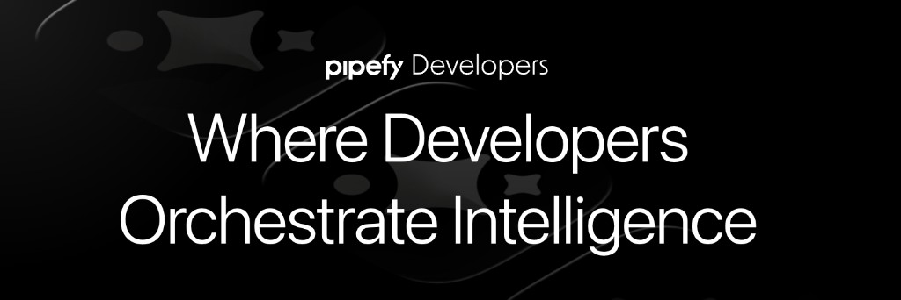

<div align="center">
  
</div>

<p align="center">
  <a href="https://github.com/gbrlcustodio/pipefy-mcp-server/actions"></a>
  <a href="https://www.python.org/downloads/"></a>
  <a href="https://github.com/astral-sh/uv"></a>
  <a href="https://modelcontextprotocol.io/introduction"></a>
  <a href="LICENSE"></a>
</p>

**Open-source MCP for Pipefy** — **128 tools** for pipes, cards, tables, relations, automations, AI, observability and more. Alpha · built in public — [feedback & issues](https://github.com/gbrlcustodio/pipefy-mcp-server/issues) or **dev@pipefy.com**


> **Disclaimer:** Community project for developer workflows — not Pipefy’s official or supported integration for external enterprise use.

## Table of contents
<p align="center">
  <a href="#mcp-tools">MCP tools</a> •
  <a href="#getting-started">Getting started</a> •
  <a href="#why-these-dependencies">Why these dependencies?</a> •
  <a href="#mcp-clients">MCP clients</a> •
  <a href="#development--testing">Development & Testing</a> •
  <a href="docs/tools/cross-cutting.md">Cross-cutting</a> •
  <a href="#contributing">Contributing</a>
</p>

---

## MCP tools

The server exposes **128 tools**, grouped below into **nine** surface areas. Canonical names live in `PIPEFY_TOOL_NAMES` (`src/pipefy_mcp/tools/registry.py`).

**Documentation for agents:** each tool’s description and `Args:` come from its Python docstring—MCP clients show that text to LLMs for routing. Use the docstrings (and the per-area docs linked in the table) as the authority on parameters and edge cases.

**Cross-cutting behavior**

Rules that apply to many tools (pagination, IDs, `debug`, `extra_input`, two-step deletes, permissions, introspection, error shape, and more) live in **[`docs/tools/cross-cutting.md`](docs/tools/cross-cutting.md)**. That page also notes **dependents** on destructive previews when optional scope args (e.g. `pipe_id` / `phase_id`) are used. Per-tool parameters stay in docstrings and the category links below.

| Category | Tools | Description | Docs |
|----------|:-----:|-------------|------|
| **Pipes & cards** | 37 | Pipes, phases, fields, labels, cards, field conditions, and card-level attachments—read/write/delete as documented per tool (card-to-card relation list/delete live under **Relations**). | [Details](docs/tools/pipes-and-cards.md) |
| **Database tables** | 17 | Tables, records (rows), schema columns (table fields), org-wide table discovery, and table-record attachment uploads. | [Details](docs/tools/database-tables.md) |
| **Relations** | 8 | Pipe relations, table relations by ID, card links, list/delete card-level relations. | [Details](docs/tools/relations.md) |
| **Reports** | 17 | Pipe and organization reports: discovery, CRUD, single pipe report read, and async exports. | [Details](docs/tools/reports.md) |
| **Automations & AI** | 22 | Traditional automations (rules engine), AI automations, and AI agents, with pre-flight validators for safer writes. | [Details](docs/tools/automations-and-ai.md) |
| **Observability** | 10 | AI agent and automation logs, usage stats, credits, job exports, status polling, and CSV fetch for finished exports. | [Details](docs/tools/observability.md) |
| **Members, email & webhooks** | 11 | Pipe membership, card inbox emails, webhooks (list/update/create/delete), and transactional email sends. | [Details](docs/tools/members-email-webhooks.md) |
| **Organization** | 1 | Fetch organization details (plan, members, pipes count). | [Details](docs/tools/organization.md) |
| **Introspection** | 5 | Schema discovery, depth-controlled type resolution, and raw GraphQL execution. | [Details](docs/tools/introspection.md) |

---

## Getting Started

### Prerequisites
- Python 3.11+
- A **Pipefy Service Account Token** (Generate in Admin Panel > Service Accounts).

Remember to add the service account to the pipe you want the AI to use.

### Installation
We recommend using `uv` for dependency management. Ensure it's [installed](https://docs.astral.sh/uv/getting-started/installation/#__tabbed_1_1).

```sh
# Clone the repository
git clone https://github.com/gbrlcustodio/pipefy-mcp-server.git
cd pipefy-mcp-server

# Sync dependencies
uv sync

# Optional: copy template and edit (full guide: docs/setup.md)
cp .env.example .env
```

**Setup, env vars, and MCP client JSON:** use **[Setup](docs/setup.md)** — single doc for first-time install, Pydantic / `.env` precedence, and Cursor / Claude examples (keys in [`.env.example`](.env.example)). Optional: `./bootstrap.sh` runs `uv sync` and creates `.env` from `.env.example` if missing.

### Why these dependencies?

The runtime stack in [`pyproject.toml`](pyproject.toml) is small on purpose. For a longer rationale (code references and security notes), see **[Dependencies](docs/dependencies.md)**. Summary:

| Package | Role in this server |
|--------|---------------------|
| **httpx** | Async HTTP client used by `gql` for GraphQL (`HTTPXAsyncTransport`), Pipefy’s internal GraphQL API, presigned S3 uploads/downloads for attachments, and downloading signed export URLs (automation job / observability flows). |
| **httpx-auth** | `OAuth2ClientCredentials` for service-account token acquisition and refresh; shared across GraphQL clients and direct `httpx` calls that need the same Pipefy OAuth settings. |
| **openpyxl** | Reads `.xlsx` export files (e.g. automation job exports) and converts the first worksheet to CSV text for MCP responses — see `observability_export_csv`. |

## MCP clients

Step-by-step JSON samples and CLI examples are in **[Setup → MCP client setup](docs/setup.md#mcp-client-setup)**.

| Client | Section |
|--------|---------|
| **Cursor** | [Cursor](docs/setup.md#cursor) |
| **Claude Desktop** | [Claude Desktop](docs/setup.md#claude-desktop) |
| **Claude Code** | [Claude Code](docs/setup.md#claude-code) |

## Development & Testing

### Running Tests

```bash
# Run all tests
uv run pytest

# Run with coverage report
uv run pytest --cov=src/pipefy_mcp/services/pipefy --cov-report=term-missing

# Integration tests (requires .env with PIPEFY_* OAuth settings)
uv run pytest -m integration -v

# Attachment upload live tests (optional IDs — see tests/tools/test_attachment_tools_live.py)
# uv run pytest tests/tools/test_attachment_tools_live.py -m integration -v
```

### MCP Inspector

```bash
npx @modelcontextprotocol/inspector uv --directory . run pipefy-mcp-server
```

### Code Quality

```bash
# Lint code
uv run ruff check src/

# Format code
uv run ruff format src/
```

### Adding or renaming an MCP tool

1. Implement the tool in the appropriate module under `src/pipefy_mcp/tools/` and call its `*Tools.register(...)` from `ToolRegistry.register_tools()` in [`src/pipefy_mcp/tools/registry.py`](src/pipefy_mcp/tools/registry.py) if it is not already wired.
2. Add the **exact tool name** (as exposed to MCP clients) to **`PIPEFY_TOOL_NAMES`** in the same file. The server uses that set for collision checks at startup and for cleanup after a failed registration; `tests/test_server.py` also asserts the live tool list matches this set.

## Contributing
We are building this in public and we need your feedback!

- **Field mapping:** If you encounter a complex field type that the Agent doesn't fill correctly, please open an issue.
- **New tools:** What other Pipefy actions would improve your workflow? Feel free to open an issue or a PR explaining what it is and how you would use it.
