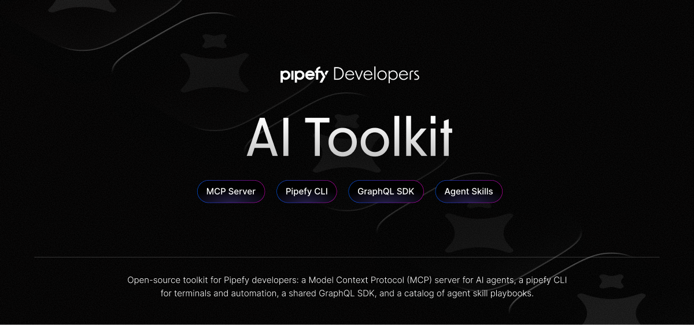

<div align="center">
  
</div>

<p align="center">
  <a href="https://github.com/pipefy/ai-toolkit/actions/workflows/ci.yml"></a>
  <a href="https://www.python.org/downloads/"></a>
  <a href="https://github.com/astral-sh/uv"></a>
  <a href="https://modelcontextprotocol.io/introduction"></a>
  <a href="LICENSE"></a>
</p>

# Pipefy AI Toolkit

Open-source toolkit for **Pipefy** developers: a Model Context Protocol (MCP) server for AI agents, a **`pipefy`** CLI for terminals and automation, a shared GraphQL SDK, and a catalog of agent skill playbooks.

<p align="center">
  <a href="#overview">Overview</a> •
  <a href="#installation">Installation</a> •
  <a href="#repository-layout">Repository layout</a> •
  <a href="#mcp-server">MCP server</a> •
  <a href="#command-line-interface">CLI</a> •
  <a href="#agent-skills">Agent skills</a> •
  <a href="#documentation">Documentation</a> •
  <a href="#development">Development</a> •
  <a href="#contributing">Contributing</a>
</p>

---

## Overview

| Component | Package / path | Purpose |
|-----------|----------------|---------|
| **MCP server** | `pipefy-mcp-server` | Exposes **187** tools to MCP clients (Cursor, Claude Desktop, Claude Code, and others). |
| **CLI** | `pipefy-cli` | Terminal commands aligned with MCP capabilities; see [`docs/parity.md`](docs/parity.md). |
| **SDK** | `pipefy` | Vendor GraphQL client, services, and models shared by MCP and CLI. |
| **Skills** | [`skills/`](skills/) | Markdown playbooks (Anthropic Skills format) for common Pipefy workflows. |

Feedback and issues: [GitHub Issues](https://github.com/pipefy/ai-toolkit/issues) · **dev@pipefy.com**

---

## Installation

**Five ways to use the toolkit** — pick one based on your client and whether you need the full tool set:

- **In Claude Code and want the fastest start with no local setup?** → **Hosted MCP**.
- **In Claude Code and want the CLI, `/pipefy:*` slash commands, or the few local-only tools?** → **Claude Code plugin**.
- **On Cursor, Claude Desktop, or Codex — or want one command for everything?** → **Quick-install script**.
- **Terminal, scripting, or CI, with no agent?** → **CLI only**.
- **Just want the workflow playbooks in any agent?** → **Skills only**.

| Install path | MCP server runs on | Tools available | Auth | Also installs | Best for |
|---|---|---|---|---|---|
| **[Hosted MCP](#1-hosted-mcp-claude-code)** | Pipefy cloud (HTTPS) | Remote-safe surface: all but the few local-file tools | In-client OAuth | nothing else | Fastest start in Claude Code; zero local Python |
| **[Claude Code plugin](#2-claude-code-plugin)** | Your machine (`uvx` stdio) | Full [tool surface](#mcp-server) | `pipefy` CLI OAuth | slash commands + skills + CLI | Claude Code users who want the CLI, slash commands & the local-only tools |
| **[Quick-install script](#3-quick-install-script)** | Your machine (stdio) | Full [tool surface](#mcp-server) | `pipefy auth login` | CLI + skills, wired into your client config | Cursor / Claude Desktop / Codex, or one-command full setup |
| **[CLI only](#4-cli-only)** | — (no MCP) | CLI commands ([parity](docs/parity.md)) | login or service account | — | Terminal use, scripting, CI |
| **[Skills only](#5-skills-only)** | — | — | — | markdown playbooks | Adding playbooks to any agent |

> **Claude Code is the recommended client** and the most complete, best-tested path today. The toolkit also works with Cursor, Claude Desktop, and Codex, but support for non–Claude Code clients is still maturing — expect some rough edges.

> **Register exactly one MCP server named `pipefy`** — do not mix the hosted HTTP server and a local stdio/plugin server under the same name. First-time setup checklist to hand your agent: [`skills/onboarding/pipefy-toolkit-setup/SKILL.md`](skills/onboarding/pipefy-toolkit-setup/SKILL.md).

> **Too many tools for your client?** The local paths can narrow what the server exposes with `--toolsets` / `PIPEFY_MCP_TOOLSETS`: by subject domain (`workflow`, `database`, `automation`, …), by persona profile (`operator`, `builder`, `admin`, …), or `power` to replace the curated tools with four catalog meta-tools the agent searches on demand. Names and precedence: [`docs/config.md`](docs/config.md).

**Authentication** (for the local paths; the hosted server uses its own in-client OAuth):

- **Human OAuth (interactive):** `pipefy auth login` runs the browser flow and stores a session in your OS keychain. Pipe access is whatever the signed-in user already has.
- **Service account (unattended / CI):** provision one in [Pipefy Admin](https://app.pipefy.com/) (Admin → Service Accounts), add it to every pipe the tools should touch, and set `PIPEFY_SERVICE_ACCOUNT_CLIENT_ID` / `PIPEFY_SERVICE_ACCOUNT_CLIENT_SECRET`.

Full env-var reference and `config.toml` precedence: [`docs/config.md`](docs/config.md).

> **Pre-1.0 note:** builds ship as pre-releases to PyPI on every tag (`uvx` and `uv tool install` resolve them automatically; the stable default lands at **v1.0**). Current line: **`v0.3.0-beta.*`** ([latest tag](https://github.com/pipefy/ai-toolkit/releases/tag/v0.3.0-beta.1)). Installing `pipefy-cli` pulls `pipefy` and `pipefy-auth` transitively. To pin a version use the PEP 440 form `pipefy-cli==0.3.0b1`; do **not** pass a global `--prerelease allow` (it lets transitive deps jump to their own pre-releases and can pull a broken build).

### 1. Hosted MCP (Claude Code)

**Pick this when:** you're in Claude Code and want the fastest start with zero local Python. The server runs on Pipefy's infrastructure and exposes the **remote-safe surface**: reads, create / update / delete, and the raw GraphQL escape hatch — everything your own API permissions allow. Withheld are only the tools whose input is a file on your machine (knowledge-base document upload, custom LLM-provider credential files); attachment uploads still work from a URL or a presigned upload target instead of a local path.

```bash
claude mcp add --transport http --scope user --client-id pipefy-mcp pipefy https://mcp.pipefy.com/mcp
```

Complete the browser login when prompted (`claude mcp login pipefy` if the client reports *Needs authentication*). If you already have a local/plugin MCP named `pipefy`, remove it first — `claude mcp remove pipefy -s user` — since the name must be unique. Need the CLI and slash commands too? Use the [Claude Code plugin](#2-claude-code-plugin) instead. Hand-wired local stdio: [`packages/mcp/README.md`](packages/mcp/README.md).

### 2. Claude Code plugin

**Pick this when:** you're in Claude Code and want the full local surface — every tool (including the local-file ones the hosted server withholds), the `/pipefy:*` slash commands, and the skill catalog. The MCP server runs locally via `uvx`.

```text
/plugin marketplace add pipefy/ai-toolkit
/plugin install pipefy
/pipefy:install
/pipefy:pipefy-login
```

Type the slash commands **in order** (the model cannot invoke `/plugin …` for you). `/plugin install pipefy` registers the local MCP server plus the `/pipefy:install` and `/pipefy:pipefy-login` commands; `/pipefy:install` runs `uv tool install` once to put `pipefy` on PATH (idempotent); `/pipefy:pipefy-login` runs the OAuth browser flow. Hand-wired setups, the macOS `errSecParam` keychain note, and the contributor local-clone alternative: [`packages/mcp/README.md`](packages/mcp/README.md). To run a local branch as the plugin, see [Test the plugin from a local checkout](#test-the-claude-code-plugin-from-a-local-checkout).

### 3. Quick-install script

**Pick this when:** you're on Cursor, Claude Desktop, or Codex — or you just want one command that installs the CLI + local MCP server, optionally adds skills, and registers the server in your client config.

```sh
curl -fsSL https://raw.githubusercontent.com/pipefy/ai-toolkit/main/install.sh \
  | sh -s -- --client cursor
```

Replace `--client cursor` with one of `claude-code`, `claude-desktop`, `codex`, or `none` (prints the snippet to paste). Useful flags: `--yes` (skip prompts), `--no-skills` (skip `npx skills add`), `--version vX.Y.Z` (pin a [Release](https://github.com/pipefy/ai-toolkit/releases)), `--dry-run` (print commands without executing), `--allow-root` (opt-in; refused by default). After install, run `pipefy auth login` (`--device` on headless systems). The installer puts `pipefy-mcp-server` on PATH, so each client's config collapses to `{"command": "pipefy-mcp-server"}`.

### 4. CLI only

**Pick this when:** you want terminal commands, scripting, or CI — no agent or MCP.

```sh
uvx --from pipefy-cli pipefy --help        # ad-hoc, no install

uv tool install pipefy-cli                 # permanent install
pipefy --install-completion bash           # or zsh, fish
pipefy auth login                          # browser OAuth, session in OS keychain
```

CLI deep-dives (auth precedence, `--token` / `PIPEFY_TOKEN`, parity matrix): [`packages/cli/README.md`](packages/cli/README.md) and [`docs/cli/`](docs/cli/README.md).

### 5. Skills only

**Pick this when:** you just want the workflow playbooks in any Markdown-aware agent (Cursor, Claude Code, Codex, and others).

```sh
npx skills add pipefy/ai-toolkit                           # all skills
npx skills add pipefy/ai-toolkit --skill pipefy-pipes-and-cards
```

Catalog and authoring guide: [`skills/README.md`](skills/README.md).

### Post-1.0 (PyPI, preview)

Once the stable line lands, the MCP server and CLI resolve straight from PyPI by name:

```sh
uvx pipefy-mcp-server
uv tool install pipefy-cli
```

Deprecation and semver (post-1.0): [`docs/DEPRECATION.md`](docs/DEPRECATION.md).

---

## Repository layout

`uv` workspace with three Python packages and a skills catalog. **`pipefy`** is the vendor GraphQL layer; MCP and CLI depend on it and do not import each other.

| Path | Distribution | Role |
|------|--------------|------|
| [`packages/sdk/`](packages/sdk/) | `pipefy` | GraphQL transport, services, queries, Pydantic models. [Package README](packages/sdk/README.md) |
| [`packages/mcp/`](packages/mcp/) | `pipefy-mcp-server` | MCP tool registration and server lifecycle. [Package README](packages/mcp/README.md) |
| [`packages/cli/`](packages/cli/) | `pipefy-cli` | Typer CLI (`pipefy` command). [Package README](packages/cli/README.md) |
| [`skills/`](skills/) | — | Agent skill playbooks. [Catalog](skills/README.md) |

---

## MCP server

The server registers **187 tools** across fourteen domains. Canonical names: `PIPEFY_TOOL_NAMES` in [`packages/mcp/src/pipefy_mcp/tools/registry.py`](packages/mcp/src/pipefy_mcp/tools/registry.py).

Tool descriptions and `Args:` blocks come from Python docstrings (what MCP clients show to models). Per-area reference docs cover parameters, edge cases, and cross-cutting behavior.

**Shared conventions** (pagination, IDs, permissions, error shape): [`docs/mcp/tools/cross-cutting.md`](docs/mcp/tools/cross-cutting.md).

| Domain | Tools | Summary | Reference |
|--------|:-----:|---------|-----------|
| **Pipes & cards** | 41 | Pipes, phases, fields, labels, cards, field conditions, attachments. Phase inventory (`get_phase_cards`, `get_phase_cards_count`), move discovery (`get_phase_allowed_move_targets`), and `create_card(phase_id=…)` reduce raw GraphQL for agent seeding. | [docs](docs/mcp/tools/pipes-and-cards.md) |
| **Database tables** | 17 | Tables, records, schema, table-record attachments. | [docs](docs/mcp/tools/database-tables.md) |
| **Relations** | 8 | Pipe and card relations. | [docs](docs/mcp/tools/relations.md) |
| **Reports** | 17 | Pipe and organization reports, async exports. | [docs](docs/mcp/tools/reports.md) |
| **Automations & AI** | 23 | Automations, AI automations, AI agents, validators. | [docs](docs/mcp/tools/automations-and-ai.md) |
| **LLM providers** | 11 | Discovery reads (custom + Pipefy-managed providers, vendor model lists, owner defaults, dependencies, read-access probe) plus custom-provider writes: create/update/delete, active-status toggle, and organization default set/reset. | [docs](docs/mcp/tools/llm-providers.md) |
| **Knowledge bases** | 14 | Pipe-scoped AI knowledge bases: list all items, plain text / document (one-shot PDF upload) / data lookup CRUD, and a read-access probe. Attach sources to agents/behaviors via `dataSourceIds`. | [docs](docs/mcp/tools/knowledge-bases.md) |
| **iPaaS** | 4 | Lazy discovery, invocation, and app-connection setup for a pipe's iPaaS (Advanced Automations) workspace (`get_ipaas_tools`, `call_ipaas_tool`, plus the connection meta-tools). | [docs](docs/mcp/tools/ipaas.md) |
| **Observability** | 11 | Logs, usage, credits, execution metrics, job exports. | [docs](docs/mcp/tools/observability.md) |
| **Members, email & webhooks** | 12 | Membership, inbox email, webhooks. | [docs](docs/mcp/tools/members-email-webhooks.md) |
| **Service accounts** | 2 | Create and delete organization service accounts (OAuth2 machine identities); attach them to pipes with `add_service_account_to_pipe`. | [docs](docs/mcp/tools/service-accounts.md) |
| **Organization** | 2 | Organization metadata and discovery. | [docs](docs/mcp/tools/organization.md) |
| **Portals** | 20 | Portal read/CRUD, pages, elements, sub-portals (publish/unpublish). | [docs](docs/mcp/tools/portal.md) |
| **Introspection** | 5 | Schema discovery and raw GraphQL. | [docs](docs/mcp/tools/introspection.md) |

---

## Command-line interface

The **`pipefy`** CLI mirrors shipped MCP capabilities where parity is defined in **[`docs/parity.md`](docs/parity.md)**. Conventions: Rich output by default, **`--json`** for scripts, **`--yes`** on destructive commands.

```sh
pipefy pipe list --json
pipefy card get 123456789
pipefy introspect query --name getPipe
```

CLI-specific guides: **[`docs/cli/`](docs/cli/README.md)** (including [introspect-then-execute](docs/cli/self-healing.md)).

---

## Agent skills

The [`skills/`](skills/) directory holds workflow playbooks: prerequisites, tool tables (MCP + CLI), steps, and success criteria. Compatible with any agent that reads Markdown (Cursor, Claude Code, Codex, and others). Distribution is via [`skills.sh`](https://github.com/vercel-labs/skills) (55+ agent targets); install commands are under [Installation](#installation) above.

Full catalog: [`skills/README.md`](skills/README.md). Authoring: [`skills/AGENTS.md`](skills/AGENTS.md). Contributions: [`CONTRIBUTING.md`](CONTRIBUTING.md).

**Card & phase agent ergonomics:** use [`skills/pipes-and-cards/pipefy-pipes-and-cards/SKILL.md`](skills/pipes-and-cards/pipefy-pipes-and-cards/SKILL.md) (workflow *Seed pipe across phases*; prefer dedicated tools over `execute_graphql`).

---

## Documentation

| Document | Description |
|----------|-------------|
| [`docs/README.md`](docs/README.md) | Index by surface (MCP, CLI, SDK). |
| [`docs/config.md`](docs/config.md) | `PIPEFY_*` environment variables, `config.toml` schema and path, precedence chain. |
| [`docs/parity.md`](docs/parity.md) | MCP tool ↔ CLI command matrix. |
| [`docs/MIGRATION.md`](docs/MIGRATION.md) | Notes for existing MCP users. |
| [`AGENTS.md`](AGENTS.md) | Repository guidelines for contributors and agents. |
| [`RELEASE.md`](RELEASE.md) | Versioning and release process. |

---

## Development

Install [`uv`](https://docs.astral.sh/uv/getting-started/installation/) if you don't have it, then from the repository root:

```bash
uv sync
[[ -f .env ]] || cp .env.example .env   # first-time setup; then fill in PIPEFY_SERVICE_ACCOUNT_*
uv run pytest -m "not integration"    # unit tests (no live API)
uv run pytest -m integration -v     # live API (requires PIPEFY_*)
uv run ruff check . && uv run ruff format .
```

**MCP Inspector** (protocol debugging):

```bash
npx @modelcontextprotocol/inspector uv --directory . run pipefy-mcp-server
```

**Adding an MCP tool:** implement under `packages/mcp/src/pipefy_mcp/tools/`, register in `ToolRegistry`, add the name to `PIPEFY_TOOL_NAMES`, and ship the matching CLI command (or document a deferral in `docs/parity.md`). See [`AGENTS.md`](AGENTS.md) for the full TDD workflow.

### Test the Claude Code plugin from a local checkout

The [Claude Code plugin install](#2-claude-code-plugin) adds the marketplace from the `pipefy/ai-toolkit` GitHub repo, which tracks `main`. To run **your local branch** (e.g. `dev`) as the plugin instead, point the marketplace at your clone:

```text
/plugin marketplace add /absolute/path/to/ai-toolkit
/plugin install pipefy@pipefy
```

Whatever is checked out in that clone — any branch — is what loads. Use the `plugin@marketplace` form (`pipefy@pipefy`) since the marketplace and the plugin share the name `pipefy`. After editing plugin files (skills, commands), run `/reload-plugins` to pick up changes without restarting.

> **Already installed the GitHub version?** A marketplace named `pipefy` can be registered only once, and a marketplace declared in `~/.claude/settings.json` under `extraKnownMarketplaces` is locked — `/plugin marketplace add` becomes a no-op (`already on disk — declared in user settings`) and keeps pointing at GitHub. Run `/plugin marketplace remove pipefy` first (or delete that `extraKnownMarketplaces` entry), **then** add the local path.

---

## Contributing

Contributions are welcome via issues and pull requests.

| Area | How to contribute |
|------|-------------------|
| **Skills** | Markdown only — see [`CONTRIBUTING.md`](CONTRIBUTING.md). |
| **MCP / CLI / SDK** | Follow [`AGENTS.md`](AGENTS.md) and [`docs/parity.md`](docs/parity.md). |
| **Field mapping gaps** | Open an issue with the field type and expected behavior. |
| **Existing MCP setups** | [`docs/MIGRATION.md`](docs/MIGRATION.md) — configuration remains compatible. |
