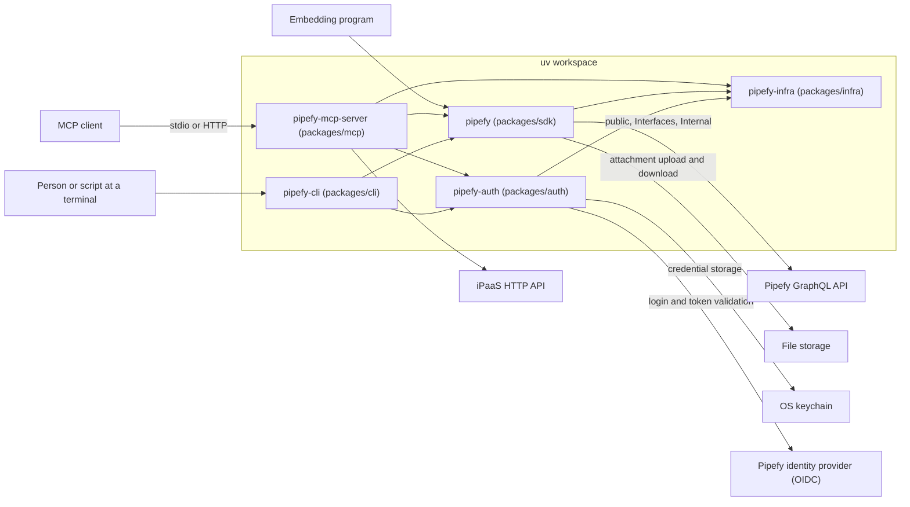

# Architecture

The toolkit gives a programmer, a script, and an LLM access to their Pipefy organizations. It ships one application for each: the SDK, the CLI, and the MCP server. This document is the map of the architecture that serves all three, down to the layers inside one package. The map explains rather than instructs. Where a check enforces part of the map, the section names that check. Where the code does not match the map, [Known gaps](#known-gaps) names the difference.

Four readers arrive here:

- A contributor who changes code starts at [Package decomposition](#package-decomposition) and reads inward from there.
- A reviewer wants the rule and the ID to cite, and both live in [`conventions.md`](conventions.md).
- A coding agent reads this document as current, so a stale sentence becomes a wrong instruction. That is why the layer order stays where a check can fail, not where a sentence can go stale.
- A consumer of one application wants its interface instead of the layer model, in [`docs/mcp`](../mcp/README.md), [`docs/cli`](../cli/README.md), or [`docs/sdk`](../sdk/README.md).

## Quality goals

Each goal states a demand that a consumer of an application holds, in that consumer's terms. Each one names the mechanism that serves it, and each mechanism section names its goal. A reason that no longer holds is then visible from either side.

**QG-1. An invalid request returns an error that tells the caller what to correct.** Every consumer holds it. The typed input contract at each application edge serves it, together with `VALID-2` and the parse rules in [`conventions.md`](conventions.md).

**QG-2. A change in the toolkit or in a vendor API does not reach the consumer's code.** The SDK consumer holds it, and so does any script or agent that names a command or a tool. The [layer model](#layer-model) and the [ports](#ports-and-dependency-inversion) keep a vendor change inside the adapter that wraps it.

**QG-3. When no human is present, a run never waits and never prompts.** The CLI consumer in a pipeline and the headless MCP consumer hold it. The client capability check decides whether elicitation can run. The CLI resolves a name only behind an explicit flag. Deterministic resolution stays in the SDK.

**QG-4. A request runs as the caller that sent it, and never as another caller.** The MCP consumer under the remote profile holds it. [Identity lifetime](#identity-lifetime) states each identity shape. The import-linter contract bans a `settings` import from the `tools` layer. `pipefy-auth` validates the inbound bearer.

**QG-5. An LLM calls by intent, not by endpoint.** The MCP consumer holds it. The outcome-shaped tool serves it, and [Known gaps](#known-gaps) records that the tool set does not express outcomes yet.

**QG-6. A destructive operation declares itself and names what it affects before it runs.** The MCP consumer and the CLI consumer hold it. The `destructiveHint` annotation marks the tool. The guard in `packages/mcp` returns a preview, which lists the dependents before the deletion runs. Consent belongs to the client, because the client is where a human is.

This document does not rank the goals, because a rank decides whose demand wins, and that decision has an owner outside this document. These trades are real:

- A confirmation that the model must answer costs a second call, so `QG-6` spends what `QG-5` saves. A confirmation that the client answers costs `QG-5` nothing.
- When no human is present, a consent dialog cannot run, so `QG-3` leaves the intent to an explicit flag.

## Constraints

Three limits that this repository does not decide.

- The MCP protocol publishes a tool's inputs as JSON Schema, and a language model fills them from that schema alone. The schema is therefore an instruction to the model, and not only a check on what arrives.
- The Pipefy GraphQL API is not ours to change, so its entity shape and its error shape come as the vendor defines them. Any better shape is a translation that we build and maintain.
- The OS keychain is not available in every environment, so credential storage carries a file backend for a headless one.

## Context and scope

In domain terms, the toolkit acts on the Pipefy organizations that a caller can access. Every call acts as a member or a service account of one of them. Inside an organization, a pipe holds the definition of a process and a card is one run of that process. A table holds records of the business entities that a process reads, and a record has no lifecycle of its own. Around those, the toolkit reaches portals, reports, members and roles, webhooks, files in storage, and the automations of a pipe. It also reaches the flows of the iPaaS, which run on a separate engine, and [`docs/ipaas.md`](../ipaas.md) defines those terms. The GraphQL schema stays the source of truth for entity shape.

The diagram draws the boundary in both directions, with the five packages inside it.

An arrow inside the workspace is a dependency that the package declares in its own `pyproject.toml`. The CLI reaches `pipefy-infra` through the SDK and through `pipefy-auth`, and it declares neither edge itself. A crossing of the boundary names the concept, not the class that implements it, and [Ports and dependency inversion](#ports-and-dependency-inversion) is where the port names live. The `transport` setting decides whether an MCP client arrives over stdio or over HTTP, and what each caller does about a credential is in [Identity lifetime](#identity-lifetime).

## The three applications

An application is what a consumer uses. Three of them expose one domain, and each one matches its consumer. The skills catalog in `skills/` also ships, and it sits outside this document: markdown playbooks with no code and no layers.

- The SDK is for a programmer. It executes a named operation deterministically and returns a domain value. It is the deterministic execution layer.
- The CLI is for a human or a script in a shell. It is thin over the SDK. Discovery is a separate command, which is idiomatic in a shell.
- The MCP server is for an LLM that acts on intent. It takes a human intent and keeps identifiers internal to the tool.

That match of application to consumer decides the layer split. The SDK executes. The CLI and the MCP server own intent, orchestration, and outcomes. The determinism of a behavior decides where that behavior lives. Deterministic resolution, such as a friendly identifier to a uuid, lives in the SDK. Ambiguous resolution lives in the CLI and the MCP server, where a human or an LLM can decide.

Each application decides its own identifier form, and there is no global choice. The SDK takes numeric identifiers first. The CLI takes deterministic identifiers. If the CLI resolves a name, it does so behind an explicit flag that fails closed under automation. The canonical form per tool and per argument is in [`docs/mcp/tools/identifiers.md`](../mcp/tools/identifiers.md).

The MCP server takes the human intent as the primary input. When the client declares the capability, the MCP server resolves ambiguity by elicitation. The declared capability of the client decides between interactive behavior and ambient behavior, so a headless caller stays deterministic.

The MCP layer prefers a tool that expresses an outcome over one tool per API endpoint. The tool count tracks user intent, not the wire. The per-tool outcome design lives in the MCP docs. `SURF-1` in [`conventions.md`](conventions.md) is the rule that admits a new tool, method, or flag.

## Package decomposition

Five packages: three applications and two shared libraries. The graph is in the diagram above. The MCP server and the CLI never depend on each other, and a shared library never depends on an application. That is the reason for the split.

The diagram draws what each package declares. Each package also carries its own ruff `TID251` ban list, with one message per banned package, and that list holds the edges that must never appear. `pipefy_infra` declares itself a leaf and bans the other four. `pipefy_auth` bans all three applications. `pipefy_sdk` bans the MCP server and the CLI. Each of those two bans the other and the private modules of the SDK.

What each package depends on, and why, is in [`dependencies.md`](dependencies.md).

## Layer model

The code has a hexagonal shape with a thin core. Most of this codebase is an adapter. `pipefy-mcp-server` wraps the MCP SDK and the Pipefy SDK. `pipefy-cli` wraps Typer over the Pipefy SDK.

The logic that is genuinely ours is small, so the core is small. A module that touches a framework does the work of an adapter, and it is not a leak. This shape serves `QG-2`, because a vendor change stops at the adapter that wraps it.

Three roles:

- Domain (core). Pure types and logic. It owns the ports that it needs from the outside. It imports no framework and no third-party SDK.
- Adapter. It translates an outside type into a domain type, or it registers domain behavior with a framework. Framework and third-party SDK imports live here. A driving adapter is entered from the outside, for example an MCP tool call or a CLI command. The core calls a driven adapter to reach the outside, for example Pipefy data access.
- Composition root. The per-application wiring, built once at startup. It is the only place that constructs concrete adapters and framework objects.

The five layers of the MCP package map onto those three roles, and the five names come from its import-linter contract.

- `server` is the composition root.
- `tools` are driving adapters.
- `core` holds the domain and the runtime wiring today.
- The `auth` layer is a driven adapter over network and keychain I/O.
- `settings` is parsed configuration at the innermost point.

The CLI has no such layers, so this mapping belongs to the MCP package alone. The module list stays in the import-linter contract at `packages/mcp/pyproject.toml`, which CI runs.

## Dependency rule

Imports point inward. An outer role can import an inner one, never the reverse.

Between packages, ruff `TID251` bans the inward-breaking imports. Each package lists the modules it must not import. Within the MCP package, import-linter holds the layer order that [Layer model](#layer-model) names. A second import-linter contract forbids a `pipefy_mcp.settings` import from the `tools` layer, and every exception in it is reviewed as a per-deployment read. The enforced spine is the acyclic import chain that holds today. It is recorded in each package's `pyproject.toml`, not restated here.

An application is entered through a driving port, for example an MCP tool call or a CLI command. A shared support library is not entered this way. It is called as a library.

## Ports and dependency inversion

Business logic depends on an interface shaped by what it needs, and the adapter implements it. This rule names where the boundary sits, so "invert" does not mean "invert everything". The boundary is domain to infrastructure: a third-party SDK, the network, a database. Ports are not universal, and the rules that add one are `PORT-1` to `PORT-3` in [`conventions.md`](conventions.md).

These are the ports the repository owns today. `GraphQLExecutor` in the SDK is a driven port over the GraphQL client. The attachment service owns `S3Uploader` and `UrlDownloader`. A test injects a fake against each. The MCP `IpaasGateway` owns an outbound HTTP chain, and a test already stands a fake in its place. Each one serves `QG-2`, because a change behind a port stops at that port.

## Composition root

The composition root does two jobs at startup: it parses raw input into decisions, and it builds effects once. Raw input means the environment, a config file, and the startup flags. Parsed types cost no I/O, so we construct them freely. At startup an effect happens only here: a keychain read, a network call, or the construction of a client. Downstream code then receives a decision it can rely on, and never a raw value it must re-read. That parse is `QG-1` applied to configuration, so an invalid value fails at startup and not in the code that later reads it.

There is one composition root per application, not one for the repo. Each one parses its startup input at its entry point. The MCP server then centralizes the wiring in `core/runtime.py` (`McpRuntime.for_profile`). The CLI wires at its entry point, without a single runtime module. Where the wiring lives is a per-application choice.

A tool module does not construct a concrete client. It receives what it needs from the composition root. A shared package exports parsed types and resolvers, not application wiring or effects. An application can wire eagerly and fail fast at boot, or it can keep effectful members lazy. That is a per-application choice.

## Identity lifetime

The local profile runs one process per user. The remote profile runs one process that serves many callers at the same time. That fact about the infrastructure decides the rest of this section. The static view above cannot express it, because the modules and the imports are identical under both profiles.

A credential is resolved once per process, or once per request.

Resolved once per process. The SDK takes its credential from settings or from the embedding program. The CLI resolves one user's credential per invocation, with the precedence in [`docs/cli/auth.md`](../cli/auth.md). The MCP local profile reads one startup credential. In all three, the process belongs to one caller.

Resolved once per request. The MCP remote profile holds no caller credential at startup, and `session_for_request` snapshots the bearer off each request. The `pipefy-auth` package then validates that bearer in the resource-server role. `StartupIdentity` and `RequestScopedIdentity` are the two shapes in code, and both delegate to `pipefy-auth`.

One rule follows, and it is what `QG-4` requires of any application here. With a per-process identity, downstream code can hold what it received. With a per-request identity, nothing caches it, and process-global state never answers a question about the caller. That is why the import-linter contract bans a `settings` import from the `tools` layer, and the full reasoning is in [`packages/mcp/CLAUDE.md`](../../packages/mcp/CLAUDE.md).

A caller can also carry state between calls, such as a vendor cursor or an export id. The API authorizes that value on each request. A handle that we mint ourselves obeys the same rule.

## Known gaps

The map above holds today, with the exceptions below. Each entry names the artifact that closes the gap, so an entry disappears when we enable its artifact.

- The framework-free core. The `core` layer of `pipefy-mcp-server` still imports `settings` and Starlette in places. The import-linter contract that locks it is written but disabled, because the pure domain has no single home module yet.
- A port over the filesystem, the OS, the network, and the keychain. `pipefy-infra` wraps the filesystem, the OS, and the network boundary. `pipefy-auth` owns network and keychain I/O. Neither one sits behind a port that its caller owns, so the artifact is a port declared under `PORT-1` to `PORT-3`.
- The outcome-shaped tool set, which is `QG-5`. The tool names copy the API operations today, so one user intent can cost several calls. `SURF-1` in [`conventions.md`](conventions.md) admits each replacement, and the gap closes when the tool set expresses outcomes.
- `QG-1` does not hold end to end. The positive-id check has three homes and no owner, so a comment model accepts a negative card id today. The artifact is one owner for that check, under `PARSE-3` in [`conventions.md`](conventions.md).

## Vocabulary

Five names carry a second meaning elsewhere, so each one is fixed here.

- Contract. Qualified at each use. The typed input contract is the parsed model at the edge of an application. The import-linter contract is the layer order in `packages/mcp/pyproject.toml`.
- Application. A package that a consumer uses, and one that owns a driving port. The SDK, the CLI, and the MCP server are the three, and a shared library is not one. The code labels the same concept `surface`, in `ClientSurface` and in a call such as `surface="mcp"`, and stamps it into the outbound `User-Agent`. This document says application instead, because the rest of the repository spends the word surface on the set of tools a deployment exposes.
- Consumer. The party that uses an application: a program that imports the SDK, a person or a script at a terminal, or an LLM. This document never calls that party a client. The word client names two other things here: the program that speaks the MCP protocol, and a constructed object such as the GraphQL client.
- SDK. A bare "SDK" means the Pipefy SDK, the `pipefy` distribution. A third-party SDK is always named, for example the MCP SDK.
- auth. `pipefy-auth` is the shared package. The `auth` layer is the driven adapter inside `pipefy-mcp-server`.
