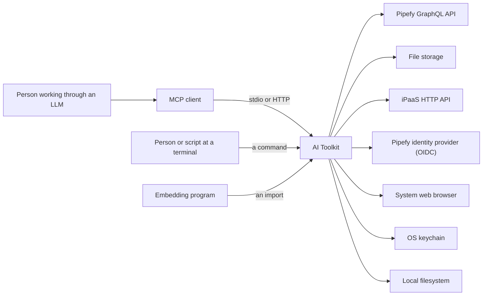
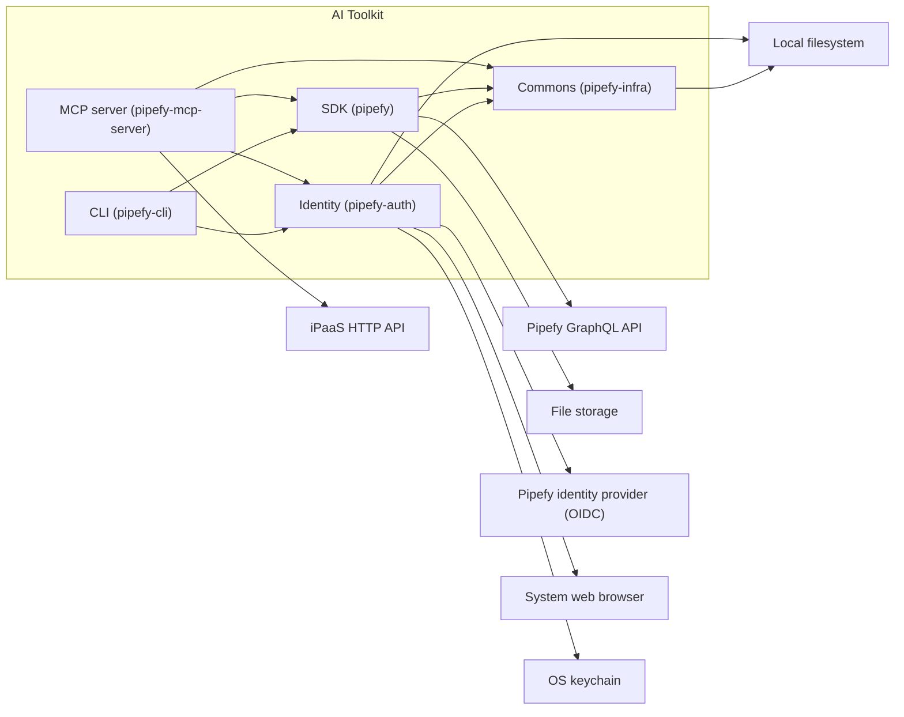
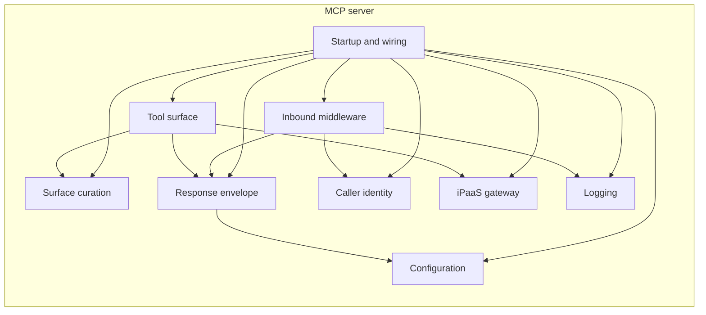
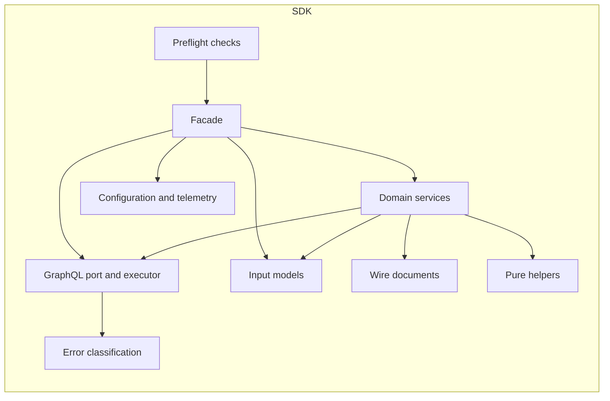
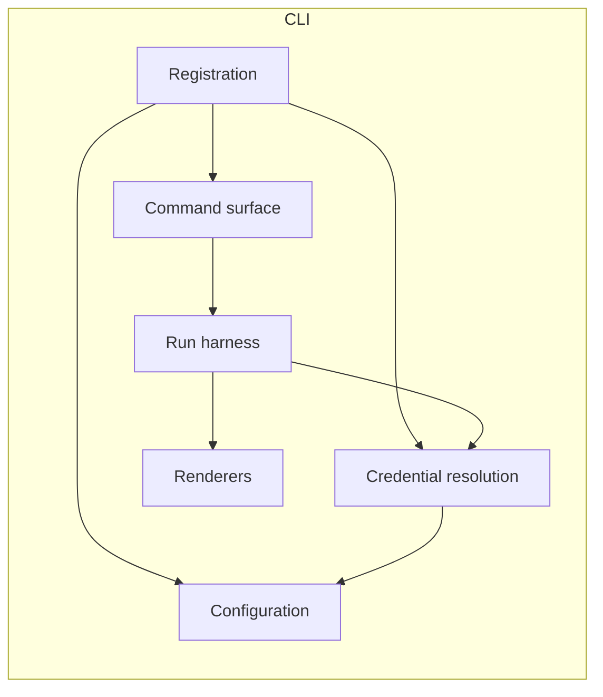
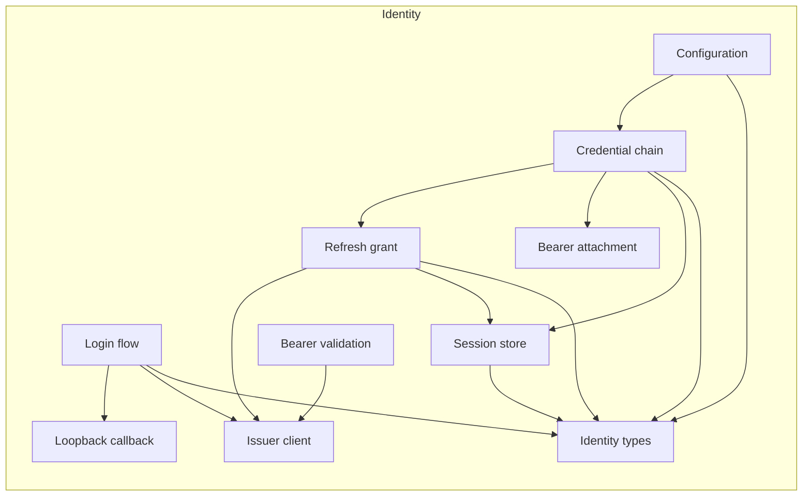
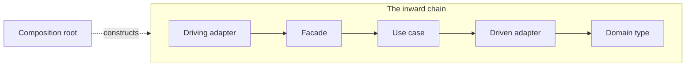

# AI Toolkit architecture

## Introduction and goals

This document maps the architecture of the AI Toolkit. The toolkit is an MCP server, a CLI, and the SDK that both build on, over Pipefy's public API.

### Requirements overview

Pipefy is fully invested in the AI ecosystem. Its own AI agents already do the work inside a process and change how the process runs. This toolkit opens the same reach to an LLM agent that Pipefy did not build.

**Toolkit functions.** A consumer comes to the toolkit for these. Each one is work that Pipefy's API leaves to the consumer, or does not offer at all.

- `FR-1` Persistent sign-in. A consumer signs in through a browser once, and later calls need no second sign-in.
- `FR-2` Name resolution. When a consumer names a resource instead of giving its id, the toolkit finds that resource, and an incomplete or misspelled name still finds it.
- `FR-3` Validation without execution. Before a consumer applies a change, the toolkit reports what would fail. The check changes nothing.
- `FR-4` Escape hatch. When no tool wraps an operation, a consumer still reaches it, and can discover what the API offers.
- `FR-5` iPaaS reach. A consumer reaches the flows of a pipe's iPaaS workspace, and needs no second credential for the engine behind them.

**Pipefy capabilities.** The functions above act on these. Each name is a sub-domain of Pipefy's domain model. The model holds ten, and the toolkit reaches the nine below. Electronic Signature is the one that the toolkit does not reach. Pipefy maintains that model internally and does not publish it, so the Domain expert row in [Stakeholders](#stakeholders) is the way to reach its owners.

- Work Execution: create a card, move it through the phases of a pipe, fill what a phase requires, comment on it, attach a file, and read or send its email.
- Process Modeling: create and change a pipe, its phases, its fields, its field conditions, its labels, and its automations. Create and change an AI agent, with the behaviors it runs and the knowledge it reads.
- Business Records: create and query a database table, its fields, and its records.
- Request Intake: the channel a requester submits through, and the portals, pages, elements, and sub-portals that make it up.
- Identity and Access Management: invite a member, set a role, and mint a service account.
- Governance and Audit: export a pipe's audit log, read an AI agent's logs, and choose the model provider an agent may use.
- Performance and Oversight: define a pipe or organization report, export it, and read usage and execution metrics.
- Billing: read the AI credits an organization consumed.
- System Integration: register a webhook, and reach an iPaaS flow.

### Quality goals

Five qualities dominate every decision on this map, in this order. The scenario in each row is the requirement itself, and [Quality scenarios](#quality-scenarios) references it rather than restating it.

| Priority | Quality goal | Scenario |
|---|---|---|
| 1 | Authenticity | Two callers hold sessions on one remote process. Each request acts as the person who sent it, so neither caller can act as the other or read the other's data. (`QR-4`) |
| 2 | Resource utilization | A model asks for one card by name. One tool call answers it, and no second call is needed to get there. (`QR-5`) |
| 3 | Diagnosability | A GraphQL call is denied. The response names the likely cause, whether a retry can succeed, and the next step. (`QR-8`) |
| 4 | Stability | Pipefy reshapes a GraphQL response. The change never reaches the consumer's code. (`QR-2`) |
| 5 | Backward compatibility | After v1.0, a release deprecates a public SDK function. A warning comes first, the function keeps working for two more minor releases, and `DEPRECATION.md` sets that period. (`QR-11`) |

### Stakeholders

These roles hold a stake in the architecture and in the documents that describe it. [Requirements overview](#requirements-overview) and [Quality requirements](#quality-requirements) state what the toolkit owes them.

The contributor row also holds what a tester, a code reviewer, and a developer would ask for, because this project has nobody who plays those parts separately. A contributor can be an agent rather than a person, which is what [`AGENTS.md`](../../AGENTS.md) exists for.

| Role/Name | Contact | Expectations |
|---|---|---|
| SDK consumer | A programmer whose code imports the `pipefy` distribution | A stable typed surface, an upstream change that does not reach their code, and use answered by [`docs/sdk`](../sdk/README.md) rather than by this map |
| CLI consumer | A person at a terminal, and a script in CI | Deterministic behavior, parseable output, no prompt when nobody is watching, a stored credential that nobody else can use, and use answered by [`docs/cli`](../cli/README.md) rather than by this map |
| MCP consumer | A person working through an LLM client | The assistant does what they asked, acts on no guess, destroys nothing unannounced, and works from a stored credential that nobody else can use, with use answered by [`docs/mcp`](../mcp/README.md) rather than by this map |
| LLM agent | AI assistants that reach the toolkit through the MCP server or the CLI, following the playbooks in [`skills/`](../../skills/README.md) | A schema it can fill without a second call, a catalog and an answer that fit in its context, a description that names rather than teaches, output it can pipe into the next call, a playbook that names only tools the server still exposes, and a success criterion it can check for itself |
| Contributor | Anyone opening a pull request, under [`CONTRIBUTING.md`](../../CONTRIBUTING.md) | Where a change goes, what it may import, whether a passing test means anything, and an entry point at [Package decomposition](#package-decomposition) that reads inward from there |
| Maintainer | The core team, at `dev@pipefy.com` | A stack it controls, a layer order a merge cannot break, and a decision that outlives whoever made it |
| Security reviewer | Whoever answers `security@pipefy.com`, per [`SECURITY.md`](../../SECURITY.md) | Trust boundaries, token validation, credential storage, and outbound URL policy |
| Privacy, Legal and Compliance | Pipefy's review team, per [`CONTRIBUTING.md`](../../CONTRIBUTING.md) | A human decides anything that touches a natural person, and a blueprint states the autonomy it assumes |
| Release manager | The maintainers who cut a release, at `dev@pipefy.com` | What counts as a breaking change, and what is owed before one ships |
| Domain expert | The owners of Pipefy's domain model, which Pipefy maintains internally and does not publish | Names that match the Pipefy product, and a vocabulary that does not drift |
| Pipefy platform | The team that owns the GraphQL API, outside this repository | A caller that identifies itself, that does not chain calls it could make in one, that gives up rather than hold a connection open, and that honors a refusal to serve |
| Operator of the remote deployment | Whoever runs the remote profile. Not named here | A bearer minted for another service refused, which tools a deployment exposes, a stored credential only the deployment can use, the credential source, the deploy shape, what reaches a log, and what one caller costs another |

Four expectations here rest on nothing: an operator's deploy shape, the platform team's identification and refusal to serve, and a blueprint's stated autonomy. Every other shortfall behind this table has an entry in [Risks and technical debt](#risks-and-technical-debt).

The contributor, the maintainer, the domain expert, and Privacy, Legal and Compliance hold no quality goal.

## Architecture constraints

Every decision on this map works inside these limits. Each row names the limit and what follows from it. A limit we imposed on our own code is a refactor candidate instead, under `CONS-1` in [`conventions.md`](conventions.md).

**Technical.**

| Constraint | Applies to | Consequence |
|---|---|---|
| Schema as the model's only instruction | MCP | A field name and its description are written for a model to read, so a schema change is a behavior change |
| No guaranteed answer from the client | MCP | The client's side of a question is optional in the protocol, so every tool needs a path that finishes without an answer |
| Vendor-owned GraphQL shape | All three | A better entity shape or error shape is a translation we build and maintain, and `QR-2` is what that buys |
| Vendor-owned domain vocabulary | All three | Every capability name comes from the domain model, never from the tool catalog, and `QR-17` is the demand it serves |
| A tool catalog we do not own | MCP | The iPaaS tools are relayed rather than reshaped, so they are the one place `QR-5` does not apply |
| No deployment we operate | MCP | Every endpoint and every exposed tool is a setting rather than a source constant, which is `QR-21`, and the unauthenticated profile refuses a non-loopback bind |
| No assumed operating system | All three | A credential store, a config path, and a file lock each take an OS-specific form |
| No keychain in some environments | CLI, MCP | Credential storage carries a file backend as well as the OS keychain |

[`docs/ipaas.md`](../ipaas.md) owns the iPaaS flow, and `install.sh` covers the POSIX platforms alone.

**Organizational.**

| Constraint | Applies to | Consequence |
|---|---|---|
| Apache 2.0 for the code and the docs | All three | A dependency carries a compatible license, or it does not land |

[`TERMS.md`](../../TERMS.md) is the notice behind that row, and it is the only limit here that engineering did not set.

## Context and scope

In domain terms, the toolkit acts on the Pipefy organizations that a caller can access. Every call acts as a member of one of them. Inside an organization, a pipe holds the definition of a process and a card is one run of that process. A table holds records of the business entities a process uses, and a record has no lifecycle of its own. [Requirements overview](#requirements-overview) names every capability the toolkit reaches around those, and the GraphQL schema owns the entity shape. The flows of the iPaaS are the exception, because they run on a separate engine, and [`docs/ipaas.md`](../ipaas.md) defines those terms.

The diagram draws the toolkit as one box, with every party it exchanges data with.

No install reaches every partner, so the table says whether the SDK, the CLI, or the MCP server reaches each one.

| Partner | What crosses | Reached by |
|---|---|---|
| Pipefy GraphQL API | Every capability in [Requirements overview](#requirements-overview) | All three |
| File storage | The bytes of an attachment, up and down | All three |
| iPaaS HTTP API | The flows of a pipe's workspace, and the credential exchange they need | The MCP server |
| Pipefy identity provider (OIDC) | A login, and the validation of an inbound bearer | The CLI and the MCP server |
| System web browser | A login handed off, and the authorization code that comes back | The CLI |
| OS keychain | A stored credential | The CLI and the MCP server |
| Local filesystem | A config file, a stored credential, and the bytes of a local file | All three |

The legend:

- The table names what crosses as a concept, and never the class that implements it. [Package decomposition](#package-decomposition) draws the same partners on the package whose code performs each crossing.
- Where a crossing has a port, [Ports and dependency inversion](#ports-and-dependency-inversion) names it, and [Risks and technical debt](#risks-and-technical-debt) carries every one that has none.
- Which application each consumer uses is in [Package decomposition](#package-decomposition), and what each one does about a credential is in [Identity lifetime](#identity-lifetime). A deployment profile decides which channel the MCP server serves.

## Solution strategy

These are the decisions everything else rests on. Some answer a goal that [Quality goals](#quality-goals) ranks, and those come first. The rest answer a stated requirement, or a commitment this project made.

| Driver | Decision | Details |
|---|---|---|
| Authenticity | Only the identity provider says who a caller is. A credential is read once for a process, or once for a request, and never held as shared state | [Identity lifetime](#identity-lifetime) |
| Resource utilization | A tool does the whole job in code, so the model spends one call rather than a chain of them. A deployment also narrows the catalog it sees | [Tool surface](#tool-surface) |
| Diagnosability | An application turns input into typed values at its edge, so nothing unchecked reaches the code behind it. Every reply has one shape, and a failure says what probably went wrong and what to do next | [Response shape](#response-shape), [Composition root](#composition-root) |
| Stability | Most of the code is an adapter around a small hexagonal core, so a vendor change stops at the adapter that wraps it | [Dependency rule](#dependency-rule), [Ports and dependency inversion](#ports-and-dependency-inversion) |
| Backward compatibility | Each public surface keeps a deprecated path working for a stated period | [`DEPRECATION.md`](../DEPRECATION.md) |
| An LLM agent reaches the domain by two mechanisms, and a person and a script reach it by one of them | The MCP server declares a schema that a client loads at connect, and the CLI takes a command that composes with other commands. Both sit over the same libraries, and dependencies point one way, so no application imports another | [Package decomposition](#package-decomposition) |
| A layer order that holds without human code review (`QR-14`) | Each package declares what it must not import, and CI fails a merge that breaks the order | [Dependency rule](#dependency-rule) |
| A change to shared behavior that lands in one pull request (`QR-26`) | Every package lives in one repository and ships on one version. One test run covers all of them | [`RELEASE.md`](../../RELEASE.md) |
| A smaller learning curve for a contributor | The toolkit is written in Python, which was the default language for work on artificial intelligence when this project began | [`dependencies.md`](dependencies.md) |
| A commitment to ship in the open | Everything in this repository is published, so a deployment's configuration and credentials cannot sit in it. The hosted wrapper that runs the remote profile is built elsewhere | [Architecture constraints](#architecture-constraints), [`CONTRIBUTING.md`](../../CONTRIBUTING.md) |

## Building block view

Level 1 is the package graph, and [Inside each package](#inside-each-package) holds level 2.

### Package decomposition

The legend:

- An arrow between two packages is a dependency that the package declares in its own `pyproject.toml`, and [Dependency rule](#dependency-rule) holds those arrows pointing one way.
- An arrow that leaves the box says which package performs that crossing. It carries no label, because [Context and scope](#context-and-scope) says what crosses each one, and which install reaches it.

Two forces produced this split. The first is the shape of the consumer, which produced the packages at the top. A programmer imports, a person types a command, and an LLM calls a tool. The second is the cost of an install, which produced the libraries beneath, so that one consumer never pays another's dependencies.

That second force is what makes `pipefy-auth` and `pipefy-infra` two packages rather than one. Because `packages/sdk/pyproject.toml` declares `pipefy-infra` and not `pipefy-auth`, a program that imports the SDK installs no keychain and no crypto stack. `packages/infra/pyproject.toml` declares pydantic alone, so every package takes it cheaply. One shared package instead of two puts the login machinery in every SDK install.

The match of consumer to package then decides where a behavior lives. The SDK executes a named operation, whereas the CLI and the MCP server own intent, orchestration, and outcomes. The determinism of a behavior settles the rest, so deterministic resolution, such as a friendly identifier to a uuid, lives in the SDK. Ambiguous resolution lives above it, where a human or an LLM can decide.

| Name | Functions | Responsibility | Interfaces | Code |
|---|---|---|---|---|
| MCP server | `FR-2`, `FR-3`, `FR-4`, `FR-5` | Serves the domain to an LLM that acts on intent, and keeps identifiers internal to the tool | A tool call, over stdio or HTTP | `packages/mcp` |
| CLI | `FR-1`, `FR-2`, `FR-3`, `FR-4` | Serves the domain to a person or a script, thin over the SDK, with discovery as a separate command | A command in a shell | `packages/cli` |
| SDK | `FR-3` | Executes a named operation deterministically and returns a domain value | The package root, held closed by a check | `packages/sdk` |
| Identity | `FR-1` | Owns every credential operation: a browser login, storage, and the validation of an inbound bearer | The package root, with nothing holding it closed | `packages/auth` |
| Commons | none | Holds what carries no Pipefy concept and what more than one package needs, which today is coercion, configuration discovery, local file reads, URL checks, and telemetry headers | The package root, with nothing holding it closed | `packages/infra` |

Because the CLI declares no edge to `pipefy-infra`, the diagram draws none, and that package arrives as a transitive of the SDK and of `pipefy-auth`. One CLI module imports it directly, which [Risks and technical debt](#risks-and-technical-debt) carries.

[Architecture constraints](#architecture-constraints) names which limits each package works inside, while [`dependencies.md`](dependencies.md) says which third-party packages each one needs, and why.

### Inside each package

Arc42 asks for a whitebox where a block is important, surprising, risky, complex, or volatile, rather than for one per block. Each section below is the whitebox of one package. The three packages that a consumer reaches earn one, and `pipefy-auth` earns one because every credential operation lives in it. `pipefy-infra` gets none, because it holds no subject to refine. A module that only re-exports, such as a package `__init__.py`, belongs to no block.

#### MCP server

The folders name a file kind rather than a block. `tools/` holds a tool body, the helper beside it, and a pure planner, while `core/` holds a driven adapter next to the envelope that every tool returns. So the table names the block, and `Code` says where that block lives.

| Name | Role | Responsibility | Interfaces | Code |
|---|---|---|---|---|
| Tool surface | Facade and use case | Declares each tool with its annotations, parses the arguments, orchestrates the calls behind it, and decides what the answer says | A registered tool, called over stdio or HTTP | `tools/*_tools.py` apart from `tools/meta_tools.py`, the `tools/*_tool_helpers.py` beside them, `tools/phase_transition_helpers.py`, `tools/field_condition_planner.py`, `tools/behavior_placeholder_interpolation.py` |
| Surface curation | Domain type, with a facade for the discovery tools | Decides which tools a deployment exposes, by subject domain, by persona profile, and by the remote marker, and holds a destructive call behind a confirmation | The `--toolsets` flag, the `meta=REMOTE` marker, and the discovery tools of the `power` profile | `tools/toolsets.py`, `tools/remote_profile.py`, `tools/meta_tools.py`, `tools/destructive_tool_guard.py`, `tools/mcp_capabilities.py` |
| Inbound middleware | Driving adapter | Wraps every inbound call before a tool body runs, and carries the logging, the quota, and the protection of what sits downstream | An ordered chain that the composition root builds | `core/tool_middleware.py`, `observability/request_log_middleware.py`, `observability/tool_log_middleware.py` |
| Response envelope | Domain type, with one driving adapter patch | Builds the single response shape that every tool returns, for a success, for an error, and for a page | Functions that a tool body calls, and one patch that startup installs | `tools/validation_envelope.py`, `core/tool_error_envelope.py`, `tools/graphql_error_helpers.py`, `tools/pagination_helpers.py`, `tools/validation_helpers.py` |
| Caller identity | Driven adapter | Holds the startup identity and the request-scoped identity, and validates an inbound bearer against the issuer | The identity that a tool body reads from its request context | `auth/` |
| iPaaS gateway | Driven adapter | Reaches a pipe's iPaaS workspace over HTTP | An async client that a tool body calls | `core/ipaas_gateway.py` |
| Logging | Driven adapter | Writes one JSON line per event to the log stream | A configured logger | `observability/json_logging.py` |
| Startup and wiring | Composition root | Parses the startup flags, builds every effect once, assembles the tool surface, and hands each request the objects it needs | The `pipefy-mcp-server` entry point | `main.py`, `server.py`, `core/runtime.py`, `core/transport_security.py`, `observability/wiring.py`, `tools/registry.py`, `tools/tool_context.py` |
| Configuration | Domain type | Holds the parsed configuration, and the documentation reference that an error message points at | A settings object that every block reads | `settings.py`, `_docs.py` |

An arrow is an import, and the diagram draws the ones that set the direction rather than every one. The `Role` column places each block on the chain that [Dependency rule](#dependency-rule) draws. Startup and wiring sits off that chain, because it builds every other block once. The tool surface is this application's driving adapter as well, because a tool call is what the outside touches, and inbound middleware wraps that call from further out.

[Tool surface](#tool-surface) at arc42 8 partitions that block by subject domain and by persona profile. That partition refines one block into a level 3, and this document does not take it.

A `_helpers` suffix predicts no block. `tools/graphql_error_helpers.py`, `tools/pagination_helpers.py`, and `tools/validation_helpers.py` build the envelope, `tools/phase_transition_helpers.py` runs a check for the tool surface, and a `tools/*_tool_helpers.py` module sits beside the tool it serves. [Risks and technical debt](#risks-and-technical-debt) carries that grouping.

import-linter holds a contract in `packages/mcp/pyproject.toml`, and CI runs it. That contract orders the folders, which runs `server > tools > core > auth > settings`, and no contract orders the blocks above. [Dependency rule](#dependency-rule) states what else that file holds, while [Risks and technical debt](#risks-and-technical-debt) names what runs unheld.

#### SDK

The SDK folders are role-pure, so a folder is one block here. The package root is where the roles mix, because a facade, a use case, a port, and a domain type all sit in it. So the table names the block, and `Code` says which modules hold it.

| Name | Role | Responsibility | Interfaces | Code |
|---|---|---|---|---|
| Facade | Facade | Constructs each service, and delegates one call per public method | `PipefyClient`, at a package root that a check holds closed | `client.py` |
| Preflight checks | Use case | Checks a change against the API rules before a consumer applies it, which is `FR-3` | Functions that a consumer calls ahead of the change | `ai_preflight.py`, `ai_pipe_validation.py`, `ai_phase_transition_validation.py`, `automation_preflight.py` |
| Domain services | Driven adapter | Runs a named operation against the Pipefy API, where a few services fan out over several calls | One method per named operation, which the facade delegates to | `services/`, and `utils/organization_identifiers.py` |
| Wire documents | Driven adapter | Holds the GraphQL document that each service sends | A document that a service imports | `queries/` |
| GraphQL port and executor | Driven adapter | Declares the `GraphQLExecutor` port, and ships the authenticated implementation behind it | The port that a service takes, and the transport that fulfills it | `graphql_executor.py` |
| Input models | Domain type | Validates what a consumer passes, before any call leaves | A pydantic model that a public method takes | `models/` |
| Error classification | Domain type | Turns a GraphQL problem into the exception that a consumer catches | The exception hierarchy, and the problem parser behind it | `exceptions.py`, `graphql_problem.py` |
| Pure helpers | Domain type | Filters a field, reads a phase inventory, formats a hint, and picks a label color, with no I/O | Functions that a service or a consumer calls | `field_filters.py`, `phase_inventory.py`, `transition_hints.py`, `label_color.py`, `behavior_placeholders.py`, `automation_input.py`, `report_filter_preflight.py`, and the rest of `utils/` |
| Configuration and telemetry | Domain type | Holds the parsed configuration, and builds the outbound headers that name the caller | A settings object, and the `User-Agent` that every request carries | `settings.py`, `telemetry.py` |

An arrow is an import, and the diagram draws the ones that set the direction rather than every one. The `Role` column places each block on the chain that [Dependency rule](#dependency-rule) draws. A library owns no composition root, because the caller wires it, so the facade constructs the services that it delegates to.

The preflight checks sit above the facade rather than below it, because each one takes a `PipefyClient` and calls it. That inverts the chain, and [Risks and technical debt](#risks-and-technical-debt) carries it.

The `utils/` folder splits between two blocks, because `organization_identifiers.py` reaches a query document while the rest are pure. [Risks and technical debt](#risks-and-technical-debt) carries that grouping too.

The SDK declares no order inside itself, so no check holds the chain above. `packages/sdk/pyproject.toml` carries the ruff `TID251` list that holds the direction between packages, and it carries nothing that holds the direction within this one.

#### CLI

The CLI folders name a file kind rather than a block, and a directory listing already gives that split. So the table names the block, and `Code` says which modules hold it.

| Name | Role | Responsibility | Interfaces | Code |
|---|---|---|---|---|
| Registration | Composition root | Registers every command group, parses the global flags, and picks the keychain backend | The `pipefy` entry point | `main.py` |
| Command surface | Facade and use case | Declares the command with its flags, then orchestrates the SDK calls behind it | One command group per resource | `commands/<resource>.py`, apart from `commands/auth.py` |
| Run harness | Driving adapter | Runs a command body, validates a shared argument, maps an exception to an exit code, and calls the chosen renderer | A wrapper that every command body runs inside | The run harness, the shared validators, and the confirmation prompt in `commands/_common.py` |
| Credential resolution | Composition root | Resolves the credential precedence chain, builds the authenticated client, and says what a keychain failure means | The `auth` command group, and the client that a command body receives | `auth.py`, `commands/auth.py`, `commands/_auth_keychain_hints.py`, and the client build in `commands/_common.py` |
| Renderers | Driven adapter | Writes JSON lines for a script, or a Rich table for a person | Two renderers, one of which the run harness picks per call | `output/` |
| Configuration | Domain type | Holds the parsed configuration, and the documentation reference that an error message points at | A settings object that every block reads | `settings.py`, `_docs.py` |

An arrow is an import, and the diagram draws the ones that set the direction rather than every one. The `Role` column places each block on the chain that [Dependency rule](#dependency-rule) draws. A command module holds two positions at once, because the function that declares the command is also the function that orchestrates the calls behind it. The run harness is this application's driving adapter, because every command body runs inside it.

Two blocks share `commands/_common.py`, which the table splits by function rather than by file. [Risks and technical debt](#risks-and-technical-debt) carries that grouping.

The CLI declares no order inside itself, so no check holds the chain above. `packages/cli/pyproject.toml` carries the ruff `TID251` list that holds the direction between packages, and it carries nothing that holds the direction within this one.

#### Identity

This package holds one subject, and it splits along the direction a credential travels. One half obtains a credential and attaches it to an outbound call, while the other half validates a credential that arrives from outside. The files are flat here, so the table names the block, and `Code` says which modules hold it.

| Name | Role | Responsibility | Interfaces | Code |
|---|---|---|---|---|
| Credential chain | Facade and use case | Decides which credential a consumer holds, which is a static token, a service account, or a stored session, and builds the authentication that a client takes | `resolve_pipefy_auth`, which every application calls, and the message that names what is missing | `resolver.py` |
| Login flow | Use case | Runs the browser login end to end, which is `FR-1`, and returns the tokens without storing them | The `pipefy auth login` command reaches it through the package root | `flow.py` |
| Loopback callback | Driving adapter | Serves the one redirect that the browser sends back on a loopback port, then stops | A redirect URI on localhost, with a port that the flow picks | `loopback.py` |
| Issuer client | Driven adapter | Finds the OIDC endpoints, exchanges a code, and revokes a token | The endpoints that discovery returns, over one shared HTTP client | `discovery.py`, `revoke.py`, `_http.py` |
| Refresh grant | Use case | Trades a refresh token for a fresh access token, under a lock that keeps two processes from racing | A refreshed token, and the lock file that guards it | `refresh.py`, `locks.py` |
| Session store | Driven adapter | Writes the session to the OS keychain, and falls back to a file where no keychain exists | The stored session that the chain and the refresh grant read | `storage.py` |
| Bearer attachment | Driven adapter | Attaches `Authorization: Bearer` to an outbound request, and refreshes the token when it expires | An `httpx.Auth` that a client takes | `bearer.py` |
| Bearer validation | Use case | Validates a bearer that arrives from outside, against the issuer's keys | The check that the MCP server runs on an inbound call | `verification.py` |
| Identity types | Domain type | Holds the OIDC client identity, the parsed token response, and the PKCE pair, with no I/O | Types that every block above takes | `identity.py`, `responses.py`, `pkce.py` |
| Configuration | Domain type | Holds the parsed authentication settings, and the settings that the inbound check reads | `AuthSettings` and `JwtValidationSettings` | `settings.py` |

An arrow is an import, and the diagram draws the ones that set the direction rather than every one. The `Role` column places each block on the chain that [Dependency rule](#dependency-rule) draws. The login flow starts the loopback callback and stops it again, so a use case owns a driving adapter for the length of one login.

This package declares no order inside itself, so no check holds the chain above. `packages/auth/pyproject.toml` carries the ruff `TID251` list that holds the direction between packages, and it carries nothing that holds the direction within this one. [Risks and technical debt](#risks-and-technical-debt) names what this package leaves open.

## Cross-cutting concepts

These rules hold whichever building block you are in, which is why none of them sits under one. A rule that one application alone obeys today still sits here, because the rule and not its reach makes it a concept.

### Dependency rule

The code has a hexagonal shape with a thin core. Most of this codebase is an adapter, because `pipefy-mcp-server` wraps the MCP SDK and the Pipefy SDK, while `pipefy-cli` wraps Typer over the Pipefy SDK. The logic that is genuinely ours is small, so the core is small. A module that touches a framework does the work of an adapter, and it is not a leak. This shape serves `QR-2`, because a vendor change stops at the adapter that wraps it. The reasoning behind the model is in the decision record [ADR-0001](adr/0001-layered-responsibility.md).

The hexagonal shape has these parts:

- Domain (core). Pure types and logic. It owns the ports that it needs from the outside. It imports no framework and no third-party SDK.
- Adapter. It translates an outside type into a domain type, or it registers domain behavior with a framework. Framework and third-party SDK imports live here.
- Composition root. The per-application wiring, which [Composition root](#composition-root) describes.

Imports point inward. An outer part can import an inner one, never the reverse. The direction holds between packages, between the layers of one package, and between the roles inside it.

Between packages, ruff `TID251` bans the inward-breaking imports, where two rules produce every entry:

- An import never runs against the direction of the level-1 diagram.
- Neither the MCP server nor the CLI imports the other, or the private modules of the SDK.

Each package's own `pyproject.toml` holds its list, with one message per banned package. Within the MCP package, import-linter holds the folder order that [MCP server](#mcp-server) names, which is `QR-14`. A second import-linter contract forbids a `pipefy_mcp.settings` import from the `tools` layer, and every exception in it is reviewed as a per-deployment read or as a startup type import. The enforced spine is the acyclic import chain that holds today, and this section restates neither list.

Inside a package, a role is the position a module takes in the inward chain, which is a domain type, a driven adapter, a use case, or a facade. The first two are the parts above at module scale, and the last two have no counterpart there. A facade imports a use case, a use case imports a driven adapter, and a driven adapter imports a domain type, whereas a domain type imports none of them. In an application a driving adapter sits outside the facade, because the outside touches it first, and a middleware around an inbound call is one. The composition root sits off that chain, because it constructs every part and therefore imports across the direction. [ADR-0004](adr/0004-vertical-slice-structure.md) holds that contract and the reasoning behind it, while `MODULE-1` and `MODULE-2` in [`conventions.md`](conventions.md) place a module by the role it takes. No package declares a check for this order, because the one contract that exists holds a folder order instead, and [Risks and technical debt](#risks-and-technical-debt) names what that leaves unheld.

A solid arrow is an import that the chain permits. The dotted arrow is construction, and the composition root imports across the chain to perform it.

An application is entered through a driving port, and its driving adapter is what the outside touches, for example an MCP tool call or a CLI command. The core calls a driven adapter to reach the outside, for example Pipefy data access. A library is not entered this way, because a caller imports it and calls it directly.

### Ports and dependency inversion

Business logic depends on an interface shaped by what it needs, and the adapter implements it. This rule names where the boundary sits, so "invert" does not mean "invert everything". The boundary is domain to infrastructure: a third-party SDK, the network, a database. Ports are not universal, and the rules that add one are `PORT-1` to `PORT-3` in [`conventions.md`](conventions.md).

These are the ports the repository owns today. `GraphQLExecutor` in the SDK is a driven port over the GraphQL client. The attachment service owns `S3Uploader` and `UrlDownloader`. A test injects a fake against each, which is `QR-13`. Each one serves `QR-2` too, because a change behind a port stops at that port. The outbound HTTP chain of the iPaaS gateway has no port, and [Risks and technical debt](#risks-and-technical-debt) carries it.

### Composition root

The composition root does two jobs at startup: it parses raw input into decisions, and it builds effects once. Raw input means the environment, a config file, and the startup flags. Parsed types cost no I/O, so we construct them freely. At startup an effect happens only here: a keychain read, a network call, or the construction of a client. Downstream code then receives a decision it can rely on, and never a raw value it must re-read. That parse is `QR-1` applied to configuration, under `VALID-2` in [`conventions.md`](conventions.md), so an invalid value fails at startup and not in the code that later reads it.

There is one composition root per application, not one for the repo. Each one parses its startup input at its entry point. The MCP server then centralizes the wiring in `core/runtime.py`. The CLI wires at its entry point, without a single runtime module. Where the wiring lives is a per-application choice.

A tool module does not construct a concrete client. It receives what it needs from the composition root. A shared package exports parsed types and resolvers, not application wiring or effects. An application can wire eagerly and fail fast at boot, or it can keep effectful members lazy. That is a per-application choice.

### Identifier resolution

No global choice sets the identifier form, because each package that a consumer reaches picks its own. The SDK takes numeric identifiers first, whereas the CLI takes deterministic ones. Where the CLI resolves a name, it does so behind an explicit flag, which fails closed under automation. The MCP server differs from both, because it takes the human intent as its primary input.

`QR-7` demands that an identifier which fits more than one resource never resolves silently. Rather than pick one resource for an ambiguous name, the MCP server returns every match.

`ARG-1` in [`conventions.md`](conventions.md) holds each argument to one form, while [`docs/mcp/tools/identifiers.md`](../mcp/tools/identifiers.md) names which form each MCP tool and argument takes. These identifier rules come from the decision record [ADR-0002](adr/0002-typed-single-form-contract.md).

### Asking the caller

A tool faces two kinds of question that look alike, although it must treat them differently. A question about data asks what to act on, whereas a question about permission asks whether to act at all. Only the first kind ever reaches the caller.

Where a tool lacks an input it needs, it asks the caller for that input, which is what `QR-22` demands. A question the model must answer costs a round trip, whereas a question that goes to the client costs `QR-5` nothing, so `QR-22` is the cheap way to satisfy `QR-5` and not a rival to it. Because not every client can take a question, [Risks and technical debt](#risks-and-technical-debt) names which callers a tool can ask, and what a tool does with the rest.

When the consumer sets up their client, they settle permission for good, so `QR-25` leaves that decision where they made it. `QR-3` rules out any wait for an answer when nobody is present, and a question about permission survives that, because the consumer settled it before the run began. A question about data does not survive, because nobody can settle a value in advance, so there `QR-22` conflicts with `QR-3`.

Each party does the one thing it alone can do:

- The MCP server states what a tool changes, both in the tool's description and in its annotations.
- The client then decides whether a human sees that statement, under settings that the human chose.
- Pipefy's API authorizes the call, so it alone can refuse one.
- Because the CLI has nobody in front of it, it both states and decides. Its consumer sets that policy with `--yes`.

[`packages/mcp/AGENTS.md`](../../packages/mcp/AGENTS.md) owns the protocol.

Today the server does more than this, because a destructive tool returns a preview and acts only on a second call that sets `confirm`. Since the model makes that second call, the preview reaches the model, and no person agrees to anything. [Risks and technical debt](#risks-and-technical-debt) carries the correction.

### Tool surface

A deployment decides how many tools a model sees, and that decision is separate from how many the catalog holds. `QR-9` is the requirement. The catalog costs context once at connect, before the consumer asks for anything, and it costs that in tool count and in words per tool, so `QR-23` bounds the words per tool.

Two axes classify the catalog. A domain is the one subject a tool is about, and the domains partition it, so every registered tool has exactly one. A tool profile is a journey-sized selection that crosses domains, and profiles overlap. `--toolsets` and `PIPEFY_MCP_TOOLSETS` name either kind, or a reserved keyword, so a deployment chooses without a source change, which is `QR-21`. [`docs/config.md`](../config.md) is the reference for those names and their precedence.

The remote profile applies a default-deny floor before any selection runs. Selection only removes, so it narrows within the floor and never widens past it. The `power` branch takes a different route. It withdraws the curated tools from the listing and registers the catalog meta-tools over them, alongside the raw GraphQL tools. The model-facing set is then a constant, whatever the catalog holds, which satisfies `QR-9` at its strongest, although every call then routes through a meta-tool, so `QR-5` is partly satisfied.

A build-time guard keys the partition to the registered tool names, so a new tool with no domain fails the build. The guard also holds the domains disjoint, and it writes no tool count down. It reads names and not subjects, so a tool filed under the wrong domain still passes.

The MCP layer prefers a tool that expresses an outcome over one tool per API endpoint. That is `QR-5`. A chain costs the model one round trip per link, so a script pays that cost once and a model pays it every link. The tool count tracks user intent, not the wire. `SURF-1` in [`conventions.md`](conventions.md) admits a new tool, method, or flag, and `TOOL-1` there states the shape one takes. The MCP docs name the outcome each shipped tool expresses. The decision record [ADR-0003](adr/0003-mcp-tools-express-outcomes.md) holds the reasoning.

The machinery is this large because the catalog is. The tool names copy the API operations today, which is the `QR-5` entry in [Risks and technical debt](#risks-and-technical-debt), so this section narrows a surface that a smaller one would not need. Closing that gap shrinks what this section has to do. The taxonomy itself is not settled either, and [Risks and technical debt](#risks-and-technical-debt) carries that. The domain and tool profile boundaries, and the reasoning behind them, are in [`packages/mcp/AGENTS.md`](../../packages/mcp/AGENTS.md).

### Response shape

This section is `PARSE-5` in [`conventions.md`](conventions.md) applied to what a tool returns.

One shape carries both outcomes, so a consumer reads success and failure the same way. A migrated MCP tool returns `success` and `data`, with `message` and `pagination` when they apply.

An invalid argument does not reach a tool body. The argument error is reshaped into that same envelope, so a caller receives the field and the rule rather than a stack trace. That is `QR-1` at the tool boundary, and [Composition root](#composition-root) is the same requirement applied to configuration.

A denial names the likely cause and the next step. A `debug` argument adds the vendor error codes and a correlation id to any GraphQL error. That is the cause half of `QR-8`. No response states whether a retry can succeed, so [Risks and technical debt](#risks-and-technical-debt) holds the other half.

A partial result is not a failure. A read that the caller may perform in part returns what succeeded, plus a list naming what was denied, which is `QR-12`. One limit comes with it: `success` stays true on that response, so the list is the only signal and a consumer that reads `success` alone misses it.

An answer costs the caller context once per call, which is `QR-10`. What a read returns by default is therefore part of its shape, and [Risks and technical debt](#risks-and-technical-debt) holds the review of those defaults.

Two limits on reach. The envelope is the MCP application's shape, because the CLI prints the underlying payload instead, and [`docs/parity.md`](../parity.md) records where the two differ. And the shape arrives by wrapping rather than as a tool's own return type. A flag switches it, it covers migrated tools only, and it reaches an internal of the MCP SDK. The requirement is right and the mechanism is not settled, so [Risks and technical debt](#risks-and-technical-debt) carries it.

### Identity lifetime

The local profile runs one process per user. The remote profile runs one process that serves many callers at the same time. That fact about the infrastructure decides the rest of this section. The static view above cannot express it, because the modules and the imports are identical under both profiles.

A credential is resolved once per process, or once per request.

Resolved once per process. The SDK takes its credential from settings or from the embedding program. The CLI resolves one user's credential per invocation, with the precedence in [`docs/cli/auth.md`](../cli/auth.md). The MCP local profile reads one startup credential. In all three, the process belongs to one caller.

Resolved once per request. The MCP remote profile holds no caller credential at startup, and it snapshots the bearer off each request. The `pipefy-auth` package then validates that bearer as the resource server. The startup identity and the request-scoped identity are the two shapes in code, and both delegate to `pipefy-auth`.

A credential also ends. `pipefy auth logout` revokes the refresh token at the provider and deletes the stored entry, so nothing can renew that credential. No process keeps a copy of a stored credential either, because every request reads it again. A token already issued keeps working until it expires, because the provider keeps no record that can recall one. The alternative asks the provider on every call whether the session still exists, and every call then pays that round trip, so a short token lifetime bounds the window instead and the provider's realm sets that lifetime. `QR-27` states that bound, and [`docs/cli/auth.md`](../cli/auth.md) owns what the command reports when a step of that logout fails.

One rule follows, and it is what `QR-4` requires of any application here. With a per-process identity, downstream code can hold what it received. With a per-request identity, nothing caches it, and process-global state never answers a question about the caller. That is why the import-linter contract bans a `settings` import from the `tools` layer, and the full reasoning is in [`packages/mcp/AGENTS.md`](../../packages/mcp/AGENTS.md).

A caller can also carry state between calls, such as a vendor cursor or an export id. The API authorizes that value on each request. A handle that we mint ourselves obeys the same rule.

## Architecture decisions

[`adr/`](adr/README.md) holds one decision record per decision. [Solution strategy](#solution-strategy) already carries the decisions that shape everything else, so the set reaches further than that section does. This document carries the rule each decision record produced, and the reasoning stays with it.

## Quality requirements

The architecture on this map exists to serve the demands below, so a section above can name what its decision satisfies, and a review can cite one ID instead of reopening the argument.

Each section names the requirement that it satisfies, in whole or in part. Where another document owns the answer instead, the row names that document. If neither holds, [Risks and technical debt](#risks-and-technical-debt) names the row.

### Quality requirements overview

Each row belongs to one or more categories, and [`quality.arc42.org`](https://quality.arc42.org/) owns the set. A category is a label over a catalog of qualities, so the categories overlap by design and none holds a row alone. Arc42 10.1 offers ISO 25010 or Q42, and this table is Q42.

| Category | Rows |
|---|---|
| `#efficient` | `QR-5`, `QR-10`, `QR-18`, `QR-23` |
| `#flexible` | `QR-21`, `QR-25`, `QR-26` |
| `#maintainable` | `QR-13`, `QR-14`, `QR-26` |
| `#operable` | `QR-1`, `QR-3`, `QR-8`, `QR-11`, `QR-12`, `QR-17`, `QR-19`, `QR-20`, `QR-22` |
| `#reliable` | `QR-1`, `QR-2`, `QR-6`, `QR-7`, `QR-8`, `QR-9`, `QR-11`, `QR-12` |
| `#safe` | `QR-6`, `QR-25` |
| `#secure` | `QR-4`, `QR-15`, `QR-16`, `QR-24`, `QR-27` |
| `#suitable` | `QR-7`, `QR-9`, `QR-13` |
| `#usable` | `QR-3`, `QR-7`, `QR-9`, `QR-11`, `QR-17`, `QR-19`, `QR-20`, `QR-21`, `QR-22`, `QR-23` |

### Quality scenarios

A row states its demand, unless [Quality goals](#quality-goals) ranks that row, in which case the goal states the demand and the row points there.

**Usage.** A demand that a caller holds while the system runs, including when a call cannot complete or a component it needs fails.

| ID | Demand | Acceptance criterion |
|---|---|---|
| `QR-1` | An invalid request names the field and the rule it broke | The response names one field and one rule, and a caller can locate the input that failed |
| `QR-3` | When no human is present, a run never waits for an answer, and it either goes ahead with what it has or fails | No run blocks on input where no terminal is attached |
| `QR-4` | [Quality goals](#quality-goals), priority 1 | A request's effect is limited to what its own caller may do |
| `QR-5` | [Quality goals](#quality-goals), priority 2 | One tool call completes one unit of user work |
| `QR-6` | What a destructive operation will destroy can be learned without running it | The reach a caller learns before the call equals what the call destroys |
| `QR-7` | A name that fits more than one resource never quietly picks one, and the caller gets the matches instead | The caller chooses between the matches, and the toolkit chooses none |
| `QR-8` | [Quality goals](#quality-goals), priority 3 | A caller can decide from the response alone whether to retry, change the input, or stop |
| `QR-9` | A model sees only the tools the consumer's work needs | The listed tool set holds no tool outside the consumer's selection |
| `QR-10` | A tool keeps its answer short, and a caller who needs more asks for more | Every read names the fields it returns by default, and an argument widens that set |
| `QR-12` | A partial result names what did not succeed | A consumer can tell which parts succeeded and which did not from the response alone |
| `QR-15` | The toolkit checks where a URL points before it fetches it, and it refuses a private address | A URL the toolkit fetches is refused where it points at a private address, as a literal and after it resolves |
| `QR-16` | A token issued for another service is refused | The bearer's audience is checked against this resource |
| `QR-17` | A name in the toolkit matches the name the Pipefy product uses | A name the toolkit exposes can be found in the Pipefy domain model |
| `QR-18` | A call that cannot finish gives up within a time the toolkit states | The call fails with a timeout rather than hanging, and one module declares the value |
| `QR-19` | One CLI command prints for a person to read and for a program to parse | A program can parse the command's output against a shape this repository declares |
| `QR-20` | An invalid change is refused before it reaches the API | No request leaves for a change the toolkit can reject |
| `QR-22` | A tool that is missing something it needs asks for it, rather than failing | The tool asks the client for the input, and it says in its answer when it could not ask |
| `QR-23` | A tool's description says briefly what the tool does, and it never teaches how to use it | A description states what the tool does and no steps for using it |
| `QR-24` | A credential the toolkit stores is usable only by whoever it was issued to | A file the toolkit creates for a credential is readable by its owner alone |
| `QR-25` | A consumer is stopped for approval only where they chose to be stopped | A consumer is stopped where their client's settings say, and nowhere else |
| `QR-27` | A logout ends the credential, and only a token already issued outlives it, until that token expires | After a logout, no new token can be issued, and the last one stops at its own expiry |

**Change.** A demand that a holder has when the system, or something it depends on, changes.

| ID | Demand | Acceptance criterion |
|---|---|---|
| `QR-2` | [Quality goals](#quality-goals), priority 4 | A vendor schema change touches no type or signature that a consumer imports |
| `QR-11` | [Quality goals](#quality-goals), priority 5 | A deprecated path keeps working for at least two minor releases |
| `QR-13` | A test can be written for any unit, and a test that passes tells the truth about the released code | A unit can be exercised with a fake in place of every dependency, and the suite runs on every platform the toolkit ships to |
| `QR-14` | A merged change never breaks the layer order | A merge that inverts the role direction fails a build check |
| `QR-21` | A deployment picks which tools it exposes by configuration, and never by changing the source | A deployment changes its tool set without a release |
| `QR-26` | A change to a behavior that more than one application uses lands as one reviewed change, tested against all of them | One test run gates the change, and no application ships it separately |

## Risks and technical debt

The map above holds today, with the exceptions below. Each entry ends by naming its target, and the entry disappears once that target exists. Where the target is not yet chosen, the entry says so.

- An undeclared CLI dependency. `packages/cli/src/pipefy_cli/commands/_auth_keychain_hints.py` imports `pipefy_infra.config`, and `packages/cli/pyproject.toml` declares no `pipefy-infra`. The import resolves today because the SDK and `pipefy-auth` both bring that package in. No check catches it, because a `TID251` list bans an import and cannot demand a declaration. That is `QR-14`. The target is the declared dependency, and the arrow in the diagram follows it.
- The framework-free core. The `core` layer of `pipefy-mcp-server` still imports `settings` and Starlette in places. The import-linter contract that locks it is written but disabled, because the pure domain has no single home module yet. That is `QR-14`. The target is a single home module for the pure domain, so the written contract can turn on.
- Use cases at the SDK package root. Several modules at the root of `packages/sdk/src/pipefy_sdk/` take a `PipefyClient` and orchestrate calls against it, so each one is a use case that imports the facade above it. Some import it at runtime, and the rest import it under `TYPE_CHECKING`. That is `QR-14`, and `MODULE-2` in [`conventions.md`](conventions.md) stops the next one from arriving. The target is a home under `services/` for each of them.
- The role order runs unchecked in every package. `.github/workflows/ci.yml` runs `lint-imports` for `packages/mcp` alone, and no other package declares an order inside itself. That contract holds the folder order that [MCP server](#mcp-server) names, and that order places `core` above `auth`. In role terms it therefore permits a domain type to import a driven adapter, and `core/tool_middleware.py` and `core/transport_security.py` both take that import. Between packages the order does hold, because ruff `TID251` bans the breaking imports in every one. That is `QR-14`. The target is an import contract per package, written on the role order rather than on the folder order. The SDK can express its domain half today, because its pure modules are already identifiable, whereas its use-case half waits on the folder axis that [ADR-0004](adr/0004-vertical-slice-structure.md) defers.
- Modules grouped by file kind, which `MODULE-1` bars. The MCP `tools/` folder holds helpers modules that split between a use case and a domain type, and `graphql_error_helpers.py` holds both at once. The SDK `utils/` folder mixes a module that reaches a query document with pure ones. `commands/_common.py` in the CLI holds a client build, a run harness, and validators in one file. That is `QR-14`, through `MODULE-1`, because a reader cannot place such a module by its name and a check cannot hold it. The target is a role-named home for each one, and the SDK half arrives with the folder axis that [ADR-0004](adr/0004-vertical-slice-structure.md) defers.
- The subject partition does not follow the module boundary. [Tool surface](#tool-surface) gives every tool one subject domain, and `attachment_tools.py`, `relation_tools.py`, `webhook_tools.py`, `report_tools.py`, and `observability_tools.py` each hold tools from two of them. The CLI groups its commands per resource, and the SDK groups its services per resource, so both cut across the subjects the same way. A change to one subject therefore reaches a module that another subject shares, and no slice can be cut along a subject today. The target is the vertical slice folders that [ADR-0004](adr/0004-vertical-slice-structure.md) defers.
- A port over the filesystem, the OS, the network, and the keychain. `pipefy-infra` wraps the filesystem, the OS, and the network boundary. `pipefy-auth` owns network and keychain I/O. The MCP `IpaasGateway` is a concrete class that builds its own HTTP client, and a test mocks that class rather than a fake behind an interface. None of the three sits behind a port that its caller owns. That is `QR-13`. The target is a port declared under `PORT-1` to `PORT-3`.
- Two of the three platforms ship unverified. Every job in `.github/workflows/` runs on `ubuntu-latest`, and three modules branch on the platform: the config directory in `packages/infra/src/pipefy_infra/config.py`, the file lock in `packages/auth/src/pipefy_auth/locks.py`, and the keychain hints in `packages/cli/src/pipefy_cli/commands/_auth_keychain_hints.py`. The Windows branch of that lock therefore never runs in a build. [`docs/cli/auth.md`](../cli/auth.md) records a credential-store failure on macOS and one on Windows, both found by hand. That is `QR-13`, because a suite that passes on one platform tells the truth about one platform. The target is an operating-system matrix on the job that runs the tests.
- The outcome-shaped tool set, which is `QR-5`. The tool names copy the API operations today, so one piece of work can cost several calls, and a model pays a round trip for each one. `SURF-1` in [`conventions.md`](conventions.md) admits each replacement, and the gap closes when the tool set expresses outcomes.
- `QR-1` does not hold end to end. The positive-id check has three homes and no owner, so a comment model accepts a negative card id today. The target is one owner for that check, under `PARSE-3` in [`conventions.md`](conventions.md).
- A caller cannot learn what a destruction costs, which is `QR-6`. Five of the 30 destructive tools never say in their first description line that the effect is permanent, and `delete_card` is one. No description states what else goes: `delete_phase` opens with "Delete a phase permanently", and it names the cards only as a count that a preview may list. Three tools compute the reach, inside a preview a caller may skip, and no CLI command computes it anywhere. The target is a permanence statement in every destructive description, and a dry run wherever the reach exceeds the arguments the caller passed. The CLI target is not yet chosen, because the reach is expensive to compute and a prompt is a poor place to print it.
- A consumer is stopped in the wrong places, which is `QR-25`. Twenty-nine of the 30 destructive tools return a preview until a second call sets `confirm`, so a consumer whose client already granted permission is stopped anyway, and the second call reaches the model rather than a person. In the other direction, 71 of the 191 registered tools write while declaring nothing, and the protocol reads an undeclared write as destructive, so a consumer who asked to be stopped before a delete is stopped before a create. The target is a declared kind on every write, held by a check that fails the build when one is missing, and no gate on any tool. It costs a break in every destructive tool's contract, which is cheapest before v1.0.
- `QR-22` holds for some callers and not others. `create_card` and `fill_card_phase_fields` ask only where `supports_elicitation` in `packages/mcp/src/pipefy_mcp/tools/mcp_capabilities.py` passes, and its docstring names what fails it. Where it fails, both tools proceed with the fields they were given and say nothing in the answer, which [`docs/mcp/tools/pipes-and-cards.md`](../mcp/tools/pipes-and-cards.md) states, with the conditions that produce it. The check is ours: the pinned `mcp` release decides how a question reaches the client, and on revision 2026-07-28 the question arrives in the tool result rather than over a back channel. The target is a tool parameter that the pinned release resolves before the body runs, and it costs the state that `create_card` holds across its `await` today.
- A settled bound on the tool surface, which is `QR-9`. The taxonomy in [Tool surface](#tool-surface) tames a catalog that is too large, so it treats a symptom of the `QR-5` entry above. The target is not yet chosen, and the exploration is open.
- The native response shape, which is `QR-1`, `QR-8`, and `QR-12`. One envelope for every outcome is the right requirement, and it arrives by wrapping: a flag, migrated tools only, and a patch on an MCP SDK internal that pins that dependency to one minor. The target is the envelope as a tool's own return type, which retires both the flag and the patch.
- No response states whether a retry can succeed, so `QR-8` holds for cause alone. The target is a retryability signal on the error envelope.
- Nobody chose what a read returns by default. Four card reads take `include_fields` and default it to false, and the envelope carries the `pagination` block that `pagination_helpers` builds, so the smaller shape is the default on those four. Every other read returns whatever its query selected, and no pass has asked whether that is the right default. That is `QR-10`. The target is a per-tool review of what each default returns, with an opt-in where more is genuinely needed. A field list on every read is the wrong target, because it spends at connect the budget that `QR-9` protects.
- `QR-2` does not hold for CLI output. The CLI prints the payload it received, so a vendor schema change reaches a script that parses `--json`. The machine-readable half of `QR-19` therefore ships without a shape anyone declared. The target is a declared output contract for the CLI.
- The skills check copies the CLI command names. A build check compares every playbook in `skills/` against the current MCP tool names and the top-level `pipefy` commands. It reads the tool names from the registered tools, and it carries its own list of the command names. The CLI registers `service-account`, and that list does not carry it, so a playbook that names the command breaks the build for the wrong reason. The target is a check that reads the registered commands, as it already reads the registered tools.
- Three functions in `Requirements overview` have no section that describes them: `FR-1`, `FR-4`, and `FR-5`. [Identity](#identity) names the blocks that run the login, and no prose walks that flow from the command to the stored session. `Tool surface` names the raw GraphQL tools once, as members of the `power` branch, and no section states that they exist for what no tool wraps. The token exchange that reaches a pipe's iPaaS workspace lives in `packages/mcp/src/pipefy_mcp/core/ipaas_gateway.py`, and no section describes it. The target is a section for each, and each one then earns a requirement.
- The SDK's typed surface reaches no consumer, which is where `QR-2` stops holding. `Package decomposition` says the SDK returns a domain value, and most service reads return an untyped mapping instead, so a vendor entity change reaches the consumer's code. The models the SDK owns are input models, and validation is the half that ships. No package ships a `py.typed` marker either, so a type checker treats the distribution as untyped and offers nothing from the annotations that do exist. The targets are a return type per read and that marker, in each distributed package.
- The tool domains are not the product's sub-domains. `DOMAINS` in `packages/mcp/src/pipefy_mcp/tools/toolsets.py` partitions every tool eight ways, and a build guard holds that partition disjoint and total. Those eight are feature areas of the product. Pipefy's domain model names ten sub-domains instead, and it treats AI as a technology woven through several of them. A builder defines an agent in Process Modeling, and the agent then acts inside Work Execution as a non-human assignee. Model choice and agent logs are one facet of Governance and Audit, and credit consumption is Billing. A woven technology does not survive a partition, so the catalog collects 36 AI tools under one key instead. That is `QR-17`. The target is one taxonomy, chosen against the model, and it costs the `--toolsets` vocabulary that a caller types today.
- A coined name where the product has one. The key holding those 36 tools is `intelligence`, and the domain model names every AI element with the product's own prefix: AI Agent, AI Automation, AI Governance, AI credit. `skills/process-intelligence` coins a second name that the model does not carry. Neither is the partition above, because re-homing no tool would fix either one. That is `QR-17`. The target is the product's word in both places, plus an audit of `skills/` for the same coinage. That rename reaches the `PIPEFY_MCP_TOOLSETS` vocabulary in [`docs/config.md`](../config.md), and it is cheapest before v1.0, when `QR-11` starts to demand a warning first.
- No stated bound on a call that cannot complete. Twelve timeout constants sit in three packages, and `VALIDATE_FETCH_TIMEOUT_SECONDS` is defined twice, as `30` in `packages/mcp/src/pipefy_mcp/tools/ai_agent_tools.py` and as `30.0` in `packages/sdk/src/pipefy_sdk/ai_preflight.py`. `QR-18` states what a caller is owed, and no module owns the value. The target is one owner for that bound.
- The audience check is off by default. `JwtValidationSettings` in `packages/auth/src/pipefy_auth/settings.py` defaults `verify_audience` to false, for the interim that runs before the identity provider issues an `aud` claim, so a deployment accepts a bearer that the same issuer minted for another resource. That is `QR-16`. The target is a remote profile that requires an audience.
- The DNS gate stops short of the identity provider. `pipefy_infra.security` holds a synchronous gate that rejects a literal private IP, an asynchronous gate that rejects a hostname resolving to one, and a composite that runs both. The two paths that fetch a URL taken from data run both, and `packages/sdk/src/pipefy_sdk/services/attachment_service.py` re-checks at connect time against a rebinding record. `packages/auth/src/pipefy_auth/discovery.py` is the exception. It takes `token_endpoint` and `jwks_uri` from the provider's own discovery document, runs the synchronous gate alone, and `pipefy-auth` then posts to the first and fetches keys from the second. A hostname that resolves to an internal address passes. That is `QR-15`. The target is the DNS gate on an endpoint a discovery document supplies, which costs an async path through a call that is synchronous today.
- A credential reaches the disk by two paths, and neither one sets a mode. The first is the file keyring, which `PIPEFY_KEYCHAIN_BACKEND=file` turns on. It writes the credential in plaintext, and `keyrings.alt` picks the mode. The code is `configure_keychain_backend` in `packages/auth/src/pipefy_auth/storage.py`. The second is `config.toml`. The toolkit reads a credential from that file and never checks its mode, and [`docs/config.md`](../config.md) tells the reader to run `chmod 600` instead. That is `QR-24`. The target is a mode on the file the toolkit creates, and a stated position on the file it only reads.
- A tool description teaches instead of naming. The 191 tool docstrings total about 150,000 characters, an average of 786 each and 7,922 for `create_ai_agent`, and a client receives every one of them at connect beside each tool's schema. `create_card` spends most of its description on elicitation behavior, transport limits, and a discovery order, which is a procedure rather than a description. `skills/` already holds the playbooks that teach a procedure, and a build check keeps them matched to the tool names. That is `QR-23`. The target is a description that names what a tool does, with the procedure moved to the skill that owns it.
- No section covers the operator. `packages/mcp/src/pipefy_mcp/observability/` holds JSON logging and two middlewares, and `packages/mcp/src/pipefy_mcp/server.py` sets `access_log=False`. The map states none of it, and no section states what reaches a log. The target is that section.
- Nothing bounds what one caller costs another. The remote profile runs one process for many callers. `packages/mcp/src/pipefy_mcp/core/tool_middleware.py` names a per-user quota and a rate limit as what the hosted profile needs, and it builds the seam that would carry them. The chain seeds one middleware, structured tool-call logging, so no inbound concurrency or rate control ships. The timeouts in `packages/mcp/src/pipefy_mcp/core/ipaas_gateway.py` bound one call, not one caller. The target is not yet chosen.
- This map has no named owner. This repository has no `CODEOWNERS` file, and the five review rubric items in [`CONTRIBUTING.md`](../../CONTRIBUTING.md) are all about a skill. Only a regulated domain has a named reviewer, at Pipefy's Privacy, Legal and Compliance team. So nothing states who has to agree before the priority order in `Quality goals` changes. A decision here therefore does not outlive the person who made it. That is the third expectation on the maintainer row in [Stakeholders](#stakeholders). The target is not yet chosen.

## Glossary

These names carry a second meaning elsewhere, so each one is fixed here.

- Contract. Qualified at each use. The typed input contract is the parsed model at the edge of an application. The import-linter contract is the layer order in `packages/mcp/pyproject.toml`.
- Agent. Qualified at each use, because this document carries three senses and no default. An AI agent is a Pipefy entity that a builder defines in a pipe, and it acts inside a process as a non-human assignee. An LLM agent is a consumer that reaches the toolkit from outside, which the `Stakeholders` table names. A contributing agent opens a pull request, under [`AGENTS.md`](../../AGENTS.md).
- Application. A package that a consumer uses, and one that owns a driving port. The CLI and the MCP server are the two. The SDK is a public library, whereas `pipefy-auth` and `pipefy-infra` are shared support libraries. The code labels a related concept `surface`, in `ClientSurface` and in a call such as `surface="mcp"`, and stamps it into the outbound `User-Agent`. That `Literal["mcp", "cli", "sdk"]` in `packages/infra/src/pipefy_infra/telemetry.py` names the same three that [`DEPRECATION.md`](../DEPRECATION.md) puts in scope. This document says application instead, because the rest of the repository spends the word surface on the set of tools a deployment exposes.
- Consumer. The party that reaches the toolkit: a program that imports the SDK, a person or a script at a terminal, or an LLM. This document never calls that party a client. The word client names two other things here: the program that speaks the MCP protocol, and a constructed object such as the GraphQL client.
- Domain. Qualified at each use. Pipefy's domain is the product, and the SDK, the CLI, and the MCP server all expose it. A sub-domain is one area of it, and [Requirements overview](#requirements-overview) names them. A tool domain is the one subject a tool is about, which [Tool surface](#tool-surface) describes. The domain layer is the model free of transport and framework, which [Dependency rule](#dependency-rule) places.
- Profile. Qualified at each use. A deployment profile is local or remote, it decides the transport default and the credential source, and [Identity lifetime](#identity-lifetime) turns on that difference. A tool profile is a persona-shaped selection that [Tool surface](#tool-surface) describes, and `--toolsets` names it. A bare "profile" in this document means the deployment profile, because that is the sense the rest of the repository carries.
- Record. Qualified at each use. A table record is one row of a Pipefy database table, which [Context and scope](#context-and-scope) places. A decision record is one architectural decision, and [`adr/`](adr/README.md) holds the set. A bare "record" in this document means the table record, because that is the sense Pipefy's domain model carries.
- Role. The position a module takes in the inward chain inside a package, which is a domain type, a driven adapter, a use case, or a facade. In an application a driving adapter sits outside the facade, and the composition root sits off that chain. [Dependency rule](#dependency-rule) states the direction between them. The `Stakeholders` table spends the word on a person instead, and Pipefy's own product sense, which [Requirements overview](#requirements-overview) names, is a member's permission set.
- SDK. A bare "SDK" means the Pipefy SDK, the `pipefy` distribution. A third-party SDK is always named, for example the MCP SDK.
- auth. `pipefy-auth` is the shared package, and Identity is the name that [Package decomposition](#package-decomposition) gives that block. The `auth` layer is the driven adapter inside `pipefy-mcp-server`. Identity and Access Management is a sub-domain of the product, which [Requirements overview](#requirements-overview) names, and the block serves the toolkit's own calls rather than that sub-domain.
