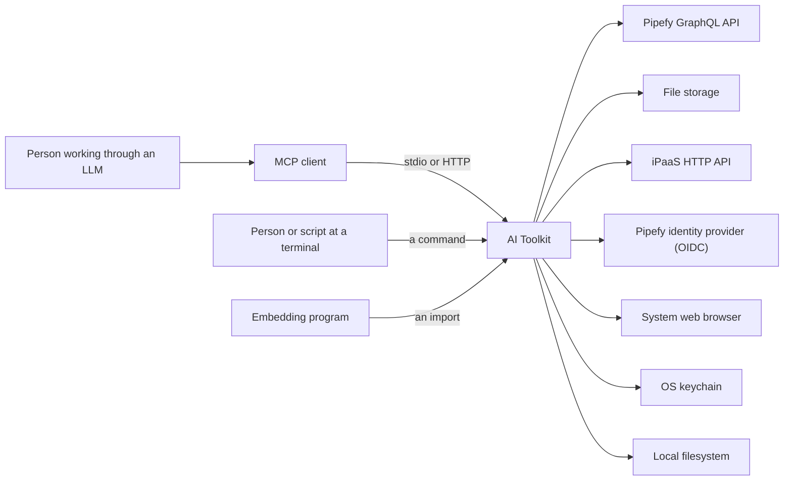
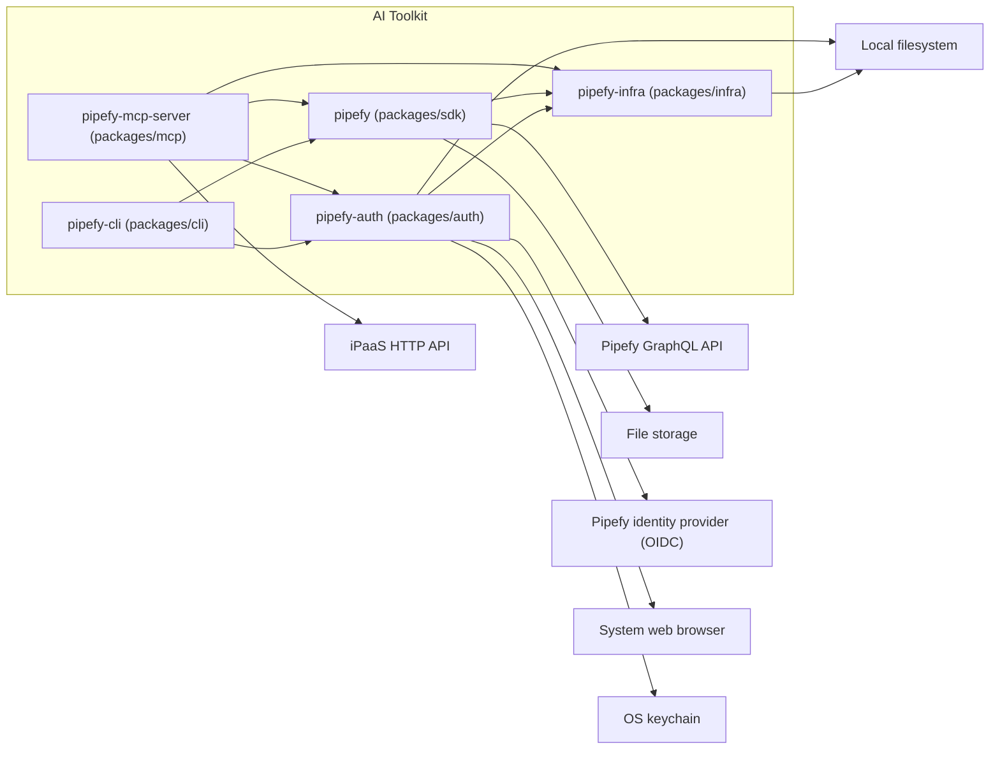

# Architecture

The toolkit gives a programmer, a script, and an LLM access to their Pipefy organizations. It ships one application for each: the SDK, the CLI, and the MCP server. This document is the map of the architecture that serves all three.

These readers arrive here:

- A contributor who changes code starts at [Package decomposition](#package-decomposition) and reads inward from there.
- A reviewer wants an ID. A convention ID names how we write code, and [`conventions.md`](conventions.md) is the reference. An `FR` ID names a function the toolkit delivers, and [Requirements overview](#requirements-overview) is the list. A `QR` ID names a demand the code must meet, and [Quality requirements](#quality-requirements) is the table.
- A consumer of one application wants its interface instead of the layer model, in [`docs/mcp`](../mcp/README.md), [`docs/cli`](../cli/README.md), or [`docs/sdk`](../sdk/README.md).

The map explains rather than instructs. It points at the owner of a fact rather than repeat it: a check, a schema, or a decision record under [`adr/`](adr/README.md). The reader pays one hop for that. A copy appears here only where the argument on this page depends on it, and [`authoring.md`](authoring.md) states the rule for every document under `docs/`.

Where the code does not match the map, [Known gaps](#known-gaps) names the difference.

## Introduction and goals

The functions the toolkit delivers, the qualities that dominate every decision about them, and the parties that hold a stake in either.

### Requirements overview

These are the functions a consumer comes to the toolkit for. Each one is work that Pipefy's API leaves to the consumer, or does not offer at all.

- `FR-1` Persistent sign-in. The CLI signs a consumer in through a browser on one command, and every later call uses the stored session. The toolkit refreshes that session before it expires, and a logout revokes it.
- `FR-2` Name resolution. When a consumer names a resource instead of giving its id, the CLI and the MCP server find that resource, and an incomplete or misspelled name still finds it.
- `FR-3` Validation without execution. Before a consumer applies a change, the toolkit checks it against the rules the API enforces and reports what would fail. The check applies nothing.
- `FR-4` Escape hatch. When no tool wraps an operation, the CLI and the MCP server still reach it, through a raw GraphQL call and schema introspection.
- `FR-5` iPaaS reach. The MCP server reaches the flows of a pipe's iPaaS workspace, and it performs the credential exchange that a separate engine needs.

Those functions act on the Pipefy capabilities below. Each name is a sub-domain of Pipefy's domain model, which lives outside this repository.

- Work Execution: create a card, move it through the phases of a pipe, fill what a phase requires, comment on it, attach a file, and read or send its email.
- Process Modeling: create and change a pipe, its phases, its fields, its field conditions, its labels, and its automations. Create and change an AI agent, with the behaviors it runs and the knowledge it reads.
- Business Records: create and query a database table, its fields, and its records.
- Request Intake: the channel a requester submits through, and the portals, pages, elements, and sub-portals that make it up.
- Identity and Access Management: invite a member, set a role, and mint a service account.
- Governance and Audit: export a pipe's audit log, read an AI agent's logs, and choose the model provider an agent may use.
- Performance and Oversight: define a pipe or organization report, export it, and read usage and execution metrics.
- Billing: read the AI credits an organization consumed.
- System Integration: register a webhook, and reach an iPaaS flow.

### Quality goals

Five qualities dominate every decision on this map, in this order. A trade that spends one of them needs an argument that names it. [Quality requirements](#quality-requirements) holds every row named below.

| Priority | Quality goal | Scenario |
|---|---|---|
| 1 | Authenticity | Two callers hold sessions on one remote process. Neither one can act as the other, and neither one can read the other's data. (`QR-4`, `QR-16`) |
| 2 | Resource utilization | A model asks for one card by name. One tool call answers it, and the response carries what was asked for rather than the whole entity. (`QR-5`, `QR-10`, `QR-18`, `QR-23`) |
| 3 | Diagnosability | A GraphQL call is denied. The response names the likely cause, the next step, and on request the vendor error codes and a correlation id. (`QR-1`, `QR-8`, `QR-12`) |
| 4 | Stability | Pipefy reshapes a GraphQL response. The change never reaches the consumer's code. (`QR-2`) |
| 5 | Backward compatibility | After v1.0, a release deprecates a public SDK function. The function keeps working for two more minor releases, and `DEPRECATION.md` sets that period. (`QR-11`) |

### Stakeholders

These roles hold a stake in the architecture and in the documents that describe it. [Requirements overview](#requirements-overview) and [Quality requirements](#quality-requirements) state what the toolkit owes them.

The contributor row also holds what a tester, a code reviewer, and a developer would ask for, because this project has nobody who plays those parts separately. A contributor can be an agent rather than a person, which is what [`AGENTS.md`](../../AGENTS.md) exists for.

| Role/Name | Contact | Expectations |
|---|---|---|
| SDK consumer | A programmer whose code imports the `pipefy` distribution | A stable typed surface, and an upstream change that does not reach their code |
| CLI consumer | A person at a terminal, and a script in CI | Deterministic behavior, parseable output, no prompt when nobody is watching, and a stored credential that nobody else can use |
| MCP consumer | A person working through an LLM client | The assistant does what they asked, acts on no guess, destroys nothing unannounced, and works from a stored credential that nobody else can use |
| LLM agent | AI assistants that reach the toolkit through the MCP server or the CLI, following the playbooks in [`skills/`](../../skills/README.md) | A schema it can fill without a second call, a catalog and an answer that fit in its context, a description that names rather than teaches, output it can pipe into the next call, a playbook that names only tools the server still exposes, and a success criterion it can check for itself |
| Contributor | Anyone opening a pull request, under [`CONTRIBUTING.md`](../../CONTRIBUTING.md) | Where a change goes, what it may import, and whether a passing test means anything |
| Maintainer | The core team, at `dev@pipefy.com` | A stack it controls, a layer order a merge cannot break, and a decision that outlives whoever made it |
| Security reviewer | Whoever answers `security@pipefy.com`, per [`SECURITY.md`](../../SECURITY.md) | Trust boundaries, token validation, credential storage, and outbound URL policy |
| Privacy, Legal and Compliance | Pipefy's review team, per [`CONTRIBUTING.md`](../../CONTRIBUTING.md) | A human decides anything that touches a natural person, and a blueprint states the autonomy it assumes |
| Release manager | The maintainers who cut a release, at `dev@pipefy.com` | What counts as a breaking change, and what is owed before one ships |
| Domain expert | The owners of Pipefy's domain model, maintained outside this repository | Names that match the Pipefy product, and a vocabulary that does not drift |
| Pipefy platform | The team that owns the GraphQL API, outside this repository | A caller that identifies itself, that does not chain calls it could make in one, that gives up rather than hold a connection open, and that honors a refusal to serve |
| Operator of the remote deployment | Whoever runs the remote profile. Not named here | A bearer minted for another service refused, which tools a deployment exposes, a stored credential only the deployment can use, the credential source, the deploy shape, what reaches a log, and what one caller costs another |

Four expectations here rest on nothing: an operator's deploy shape, the platform team's identification and refusal to serve, and a blueprint's stated autonomy. Every other shortfall behind this table has an entry in [Known gaps](#known-gaps).

The contributor, the maintainer, the domain expert, and Privacy, Legal and Compliance hold no quality goal.

## Architecture constraints

Every decision on this map works inside these limits. Each row names the limit and what follows from it. A limit we imposed on our own code is a refactor candidate instead, under `CONS-1` in [`conventions.md`](conventions.md).

**Technical.**

| Constraint | Applies to | Consequence |
|---|---|---|
| Schema as the model's only instruction | MCP | A field name and its description are written for a model to read, so a schema change is a behavior change |
| No guaranteed answer from the client | MCP | The client's side of a question is optional in the protocol, so every tool needs a path that finishes without an answer |
| Vendor-owned GraphQL shape | All three | A better entity shape or error shape is a translation we build and maintain, and `QR-2` is what that buys |
| Vendor-owned domain vocabulary | All three | Every capability name comes from the domain model, never from the tool catalog, and `QR-17` is the demand it serves |
| A tool catalog we do not own | MCP | The iPaaS tools are relayed rather than reshaped, so they are the one place `QR-5` does not apply |
| No deployment we operate | MCP | Every endpoint and every exposed tool is a setting rather than a source constant, which is `QR-21`, and the unauthenticated profile refuses a non-loopback bind |
| No assumed operating system | All three | A credential store, a config path, and a file lock each take an OS-specific form |
| No keychain in some environments | CLI, MCP | Credential storage carries a file backend as well as the OS keychain |

The hosted wrapper that runs the remote profile is built outside this repository. [`docs/ipaas.md`](../ipaas.md) owns the iPaaS flow, and `install.sh` covers the POSIX platforms alone.

**Organizational.**

| Constraint | Applies to | Consequence |
|---|---|---|
| Apache 2.0 for the code and the docs | All three | A dependency carries a compatible license, or it does not land |

[`TERMS.md`](../../TERMS.md) is the notice behind that row, and it is the only limit here that engineering did not set.

## Context and scope

In domain terms, the toolkit acts on the Pipefy organizations that a caller can access. Every call acts as a member of one of them. Inside an organization, a pipe holds the definition of a process and a card is one run of that process. A table holds records of the business entities a process uses, and a record has no lifecycle of its own. [Requirements overview](#requirements-overview) names every capability the toolkit reaches around those, and the GraphQL schema owns the entity shape. The flows of the iPaaS are the exception, because they run on a separate engine, and [`docs/ipaas.md`](../ipaas.md) defines those terms.

The diagram draws the toolkit as one box, with every party it exchanges data with.

No install reaches every partner, so the table says which of the three applications reaches each one.

| Partner | What crosses | Reached by |
|---|---|---|
| Pipefy GraphQL API | Every capability in [Requirements overview](#requirements-overview) | All three |
| File storage | The bytes of an attachment, up and down | All three |
| iPaaS HTTP API | The flows of a pipe's workspace, and the credential exchange they need | The MCP server |
| Pipefy identity provider (OIDC) | A login, and the validation of an inbound bearer | The CLI and the MCP server |
| System web browser | A login handed off, and the authorization code that comes back | The CLI |
| OS keychain | A stored credential | The CLI and the MCP server |
| Local filesystem | A config file, a stored credential, and the bytes of a local file | All three |

The legend:

- The table names what crosses as a concept, and never the class that implements it. [Package decomposition](#package-decomposition) draws the same partners on the package whose code performs each crossing.
- Where a crossing has a port, [Ports and dependency inversion](#ports-and-dependency-inversion) names it, and [Known gaps](#known-gaps) carries every one that has none.
- Which application each consumer uses is in [Applications](#applications), and what each one does about a credential is in [Identity lifetime](#identity-lifetime). A deployment profile decides which channel the MCP server serves.

## Building block view

Level 1 is the package graph. What follows descends into it: the packages a consumer uses, and the roles that the modules of a package take.

### Package decomposition

Three applications and two shared libraries. The MCP server and the CLI never depend on each other, and a shared library never depends on an application. That is the reason for the split.

The legend:

- An arrow between two packages is a dependency that the package declares in its own `pyproject.toml`.
- An arrow that leaves the box carries no label here. [Context and scope](#context-and-scope) says what crosses each one.

The CLI declares no edge to `pipefy-infra`, so the diagram draws none, and that package arrives as a transitive of the SDK and of `pipefy-auth`. One CLI module imports it directly, and [Known gaps](#known-gaps) carries that.

Each package also carries its own ruff `TID251` ban list, with one message per banned package. That list holds the edges that must never appear, and two rules produce every entry. An import never runs against the direction of the diagram. The MCP server and the CLI also never import each other, or the private modules of the SDK. Each package's own `pyproject.toml` holds its list.

What each package depends on, and why, is in [`dependencies.md`](dependencies.md).

### Applications

An application is what a consumer uses. Each one exposes the same domain, and each one matches its consumer. [Architecture constraints](#architecture-constraints) names which limits each one works inside.

- The SDK is for a programmer. It executes a named operation deterministically and returns a domain value. It is the deterministic execution layer.
- The CLI is for a human or a script in a shell. It is thin over the SDK. Discovery is a separate command, which is idiomatic in a shell.
- The MCP server is for an LLM that acts on intent. It takes a human intent and keeps identifiers internal to the tool.

That match of application to consumer decides the layer split. The SDK executes. The CLI and the MCP server own intent, orchestration, and outcomes. The determinism of a behavior decides where that behavior lives. Deterministic resolution, such as a friendly identifier to a uuid, lives in the SDK. Ambiguous resolution lives in the CLI and the MCP server, where a human or an LLM can decide.

Each application decides its own identifier form, and there is no global choice. The SDK takes numeric identifiers first. The CLI takes deterministic identifiers. If the CLI resolves a name, it does so behind an explicit flag that fails closed under automation. An identifier that can match more than one resource therefore never resolves silently, which is what `QR-7` requires. `ARG-1` in [`conventions.md`](conventions.md) holds each argument to one form, and [`docs/mcp/tools/identifiers.md`](../mcp/tools/identifiers.md) names which one, per tool and per argument. These identifier rules come from the decision record [ADR-0002](adr/0002-typed-single-form-contract.md).

The MCP server takes the human intent as the primary input. It never picks one resource for an ambiguous name. It returns the matches, which is how it meets `QR-7`. Where a tool lacks an input it needs, it asks for that input rather than failing, which is `QR-22`, and [Known gaps](#known-gaps) states which callers it can ask. Whether the caller can be asked decides between interactive behavior and ambient behavior, so a caller that cannot be asked stays deterministic, which is what `QR-3` requires.

Destruction looks like the same problem, and it is not. An ambiguous name is a question about data, and the MCP server is the only party that can answer it. A delete raises a question about permission, and the consumer answered that one when they set up their client. The server therefore does not ask it again, which is `QR-25`. `QR-3` rules out asking anyway: when nobody is present to answer, no run waits for one.

Each party then does the part it is placed to do. The MCP server says what a tool changes, in the tool's description and in its annotations. The client decides whether to put that in front of its human, under settings that human chose. Pipefy's API authorizes, and it alone can refuse. The CLI has nobody in front of it, so it both describes and decides, and `--yes` is where its consumer sets the policy. [`packages/mcp/AGENTS.md`](../../packages/mcp/AGENTS.md) owns the protocol.

Today the server does more than that. A destructive tool returns a preview, and it acts only on a second call that sets `confirm`. The model makes that second call, so the preview informs the model and no person agrees to anything. [Known gaps](#known-gaps) carries the correction.

The MCP layer prefers a tool that expresses an outcome over one tool per API endpoint, which is what `QR-5` asks for. The tool count tracks user intent, not the wire. `SURF-1` in [`conventions.md`](conventions.md) admits a new tool, method, or flag, and `TOOL-1` there states the shape one takes. What outcome each shipped tool expresses is in the MCP docs. The reasoning is in the decision record [ADR-0003](adr/0003-mcp-tools-express-outcomes.md).

### Layer model

The code has a hexagonal shape with a thin core. Most of this codebase is an adapter. `pipefy-mcp-server` wraps the MCP SDK and the Pipefy SDK. `pipefy-cli` wraps Typer over the Pipefy SDK.

The logic that is genuinely ours is small, so the core is small. A module that touches a framework does the work of an adapter, and it is not a leak. This shape serves `QR-2`, because a vendor change stops at the adapter that wraps it.

The roles:

- Domain (core). Pure types and logic. It owns the ports that it needs from the outside. It imports no framework and no third-party SDK.
- Adapter. It translates an outside type into a domain type, or it registers domain behavior with a framework. Framework and third-party SDK imports live here. A driving adapter is entered from the outside, for example an MCP tool call or a CLI command. The core calls a driven adapter to reach the outside, for example Pipefy data access.
- Composition root. The per-application wiring, built once at startup. It is the only place that constructs concrete adapters and framework objects.

The layers of the MCP package map onto those roles, and their names come from its import-linter contract.

- `server` and `core/runtime.py` are the composition root.
- `tools` are driving adapters.
- `core` holds the domain and the runtime wiring today.
- The `auth` layer is a driven adapter over network and keychain I/O.
- `settings` is parsed configuration at the innermost point.

The CLI has no such layers, so this mapping belongs to the MCP package alone. The module list stays in the import-linter contract at `packages/mcp/pyproject.toml`, which CI runs. The reasoning behind the model is in the decision record [ADR-0001](adr/0001-layered-responsibility.md).

## Cross-cutting concepts

These rules hold whichever building block you are in, which is why none of them sits under one. A rule that one application alone obeys today still sits here, because the rule and not its reach makes it a concept.

### Dependency rule

Imports point inward. An outer role can import an inner one, never the reverse.

Between packages, ruff `TID251` bans the inward-breaking imports. Each package lists the modules it must not import. Within the MCP package, import-linter holds the layer order that [Layer model](#layer-model) names, which is `QR-14`. A second import-linter contract forbids a `pipefy_mcp.settings` import from the `tools` layer, and every exception in it is reviewed as a per-deployment read or as a startup type import. The enforced spine is the acyclic import chain that holds today. It is recorded in each package's `pyproject.toml`, not restated here.

An application is entered through a driving port, for example an MCP tool call or a CLI command. A shared support library is not entered this way. It is called as a library.

### Ports and dependency inversion

Business logic depends on an interface shaped by what it needs, and the adapter implements it. This rule names where the boundary sits, so "invert" does not mean "invert everything". The boundary is domain to infrastructure: a third-party SDK, the network, a database. Ports are not universal, and the rules that add one are `PORT-1` to `PORT-3` in [`conventions.md`](conventions.md).

These are the ports the repository owns today. `GraphQLExecutor` in the SDK is a driven port over the GraphQL client. The attachment service owns `S3Uploader` and `UrlDownloader`. A test injects a fake against each, which is `QR-13`. Each one serves `QR-2` too, because a change behind a port stops at that port. The outbound HTTP chain of the iPaaS gateway has no port, and [Known gaps](#known-gaps) carries it.

### Composition root

The composition root does two jobs at startup: it parses raw input into decisions, and it builds effects once. Raw input means the environment, a config file, and the startup flags. Parsed types cost no I/O, so we construct them freely. At startup an effect happens only here: a keychain read, a network call, or the construction of a client. Downstream code then receives a decision it can rely on, and never a raw value it must re-read. That parse is `QR-1` applied to configuration, under `VALID-2` in [`conventions.md`](conventions.md), so an invalid value fails at startup and not in the code that later reads it.

There is one composition root per application, not one for the repo. Each one parses its startup input at its entry point. The MCP server then centralizes the wiring in `core/runtime.py`. The CLI wires at its entry point, without a single runtime module. Where the wiring lives is a per-application choice.

A tool module does not construct a concrete client. It receives what it needs from the composition root. A shared package exports parsed types and resolvers, not application wiring or effects. An application can wire eagerly and fail fast at boot, or it can keep effectful members lazy. That is a per-application choice.

### Tool surface

A deployment decides how many tools a model sees, and that decision is separate from how many the catalog holds. `QR-9` is the requirement.

Two axes classify the catalog. A domain is the one subject a tool is about, and the domains partition it, so every registered tool has exactly one. A tool profile is a journey-sized selection that crosses domains, and profiles overlap. `--toolsets` and `PIPEFY_MCP_TOOLSETS` name either kind, or a reserved keyword, so a deployment chooses without a source change, which is `QR-21`. [`docs/config.md`](../config.md) is the reference for those names and their precedence.

The remote profile applies a default-deny floor before any selection runs. Selection only removes, so it narrows within the floor and never widens past it. The `power` branch takes a different route. It withdraws the curated tools from the listing and registers the catalog meta-tools over them, alongside the raw GraphQL tools. The model-facing set is then a constant, whatever the catalog holds, which is `QR-9` met at its strongest.

A build-time guard keys the partition to the registered tool names, so a new tool with no domain fails the build. The guard also holds the domains disjoint, and it writes no tool count down. It reads names and not subjects, so a tool filed under the wrong domain still passes.

The machinery is this large because the catalog is. The tool names copy the API operations today, which is the `QR-5` entry in [Known gaps](#known-gaps), so this section narrows a surface that a smaller one would not need. Closing that gap shrinks what this section has to do. The taxonomy itself is not settled either, and [Known gaps](#known-gaps) carries that. The domain and tool profile boundaries, and the reasoning behind them, are in [`packages/mcp/AGENTS.md`](../../packages/mcp/AGENTS.md).

### Response shape

This section is `PARSE-5` in [`conventions.md`](conventions.md) applied to what a tool returns.

One shape carries both outcomes, so a consumer reads success and failure the same way. A migrated MCP tool returns `success` and `data`, with `message` and `pagination` when they apply.

An invalid argument does not reach a tool body. The argument error is reshaped into that same envelope, so a caller receives the field and the rule rather than a stack trace. That is `QR-1` at the tool boundary, and [Composition root](#composition-root) is the same requirement applied to configuration.

A denial names the likely cause and the next step. A `debug` argument adds the vendor error codes and a correlation id to any GraphQL error. That is the cause half of `QR-8`. No response states whether a retry can succeed, so [Known gaps](#known-gaps) holds the other half.

A partial result is not a failure. A read that the caller may perform in part returns what succeeded, plus a list naming what was denied, which is `QR-12`. One limit comes with it: `success` stays true on that response, so the list is the only signal and a consumer that reads `success` alone misses it.

Two limits on reach. The envelope is the MCP application's shape, because the CLI prints the underlying payload instead, and [`docs/parity.md`](../parity.md) records where the two differ. And the shape arrives by wrapping rather than as a tool's own return type. A flag switches it, it covers migrated tools only, and it reaches an internal of the MCP SDK. The requirement is right and the mechanism is not settled, so [Known gaps](#known-gaps) carries it.

### Identity lifetime

The local profile runs one process per user. The remote profile runs one process that serves many callers at the same time. That fact about the infrastructure decides the rest of this section. The static view above cannot express it, because the modules and the imports are identical under both profiles.

A credential is resolved once per process, or once per request.

Resolved once per process. The SDK takes its credential from settings or from the embedding program. The CLI resolves one user's credential per invocation, with the precedence in [`docs/cli/auth.md`](../cli/auth.md). The MCP local profile reads one startup credential. In all three, the process belongs to one caller.

Resolved once per request. The MCP remote profile holds no caller credential at startup, and it snapshots the bearer off each request. The `pipefy-auth` package then validates that bearer in the resource-server role. The startup identity and the request-scoped identity are the two shapes in code, and both delegate to `pipefy-auth`.

One rule follows, and it is what `QR-4` requires of any application here. With a per-process identity, downstream code can hold what it received. With a per-request identity, nothing caches it, and process-global state never answers a question about the caller. That is why the import-linter contract bans a `settings` import from the `tools` layer, and the full reasoning is in [`packages/mcp/AGENTS.md`](../../packages/mcp/AGENTS.md).

A caller can also carry state between calls, such as a vendor cursor or an export id. The API authorizes that value on each request. A handle that we mint ourselves obeys the same rule.

## Architecture decisions

[`adr/`](adr/README.md) holds the set, one record per decision. This document carries the rule a record produced, and the record keeps the why.

## Quality requirements

The architecture on this map exists to serve the demands below, so a section above can name what its decision answers, and a review can cite one ID instead of reopening the argument.

Each row carries the dimensions of the quality it instantiates, and [`quality.arc42.org`](https://quality.arc42.org/) owns both. A dimension is a label over a catalog of qualities, so it overlaps with the others by design and it never holds one row alone.

**Usage.** A demand that a caller holds while the system runs normally.

| ID | Dimensions | Demand |
|---|---|---|
| `QR-1` | `#operable` `#reliable` | An invalid request names the field and the rule it broke |
| `QR-3` | `#usable` `#operable` | When no human is present, a run never waits for an answer, and it either goes ahead with what it has or fails |
| `QR-4` | `#secure` | A request acts as the person who sent it, and never as anyone else |
| `QR-5` | `#efficient` | A request finishes without the model making a chain of tool calls to get there |
| `QR-6` | `#safe` `#reliable` | What a destructive operation will destroy can be learned without running it |
| `QR-7` | `#usable` `#reliable` `#suitable` | A name that fits more than one resource never quietly picks one, and the caller gets the matches instead |
| `QR-9` | `#usable` `#reliable` `#suitable` | A model sees only the tools the consumer's work needs |
| `QR-10` | `#efficient` | A tool keeps its answer short, and a caller who needs more asks for more |
| `QR-15` | `#secure` | The toolkit checks where a URL points before it fetches it, and it refuses a private address |
| `QR-16` | `#secure` | A token issued for another service is refused |
| `QR-17` | `#usable` `#operable` | A name in the toolkit matches the name the Pipefy product uses |
| `QR-19` | `#usable` `#operable` | One CLI command prints for a person to read and for a program to parse |
| `QR-20` | `#usable` `#operable` | An invalid change is refused before it reaches the API |
| `QR-22` | `#usable` `#operable` | A tool that is missing something it needs asks for it, rather than failing |
| `QR-23` | `#usable` `#efficient` | A tool's description says briefly what the tool does, and it never teaches how to use it |
| `QR-24` | `#secure` | A credential the toolkit stores is usable only by whoever it was issued to |
| `QR-25` | `#safe` `#flexible` | A consumer is stopped for approval only where they chose to be stopped |

**Failure.** A demand that a caller holds when a call cannot complete, or a component it needs fails.

| ID | Dimensions | Demand |
|---|---|---|
| `QR-8` | `#operable` `#reliable` | A failure names its cause, whether a retry can succeed, and the next step |
| `QR-12` | `#operable` `#reliable` | A partial result names what did not succeed |
| `QR-18` | `#efficient` | A call that cannot finish gives up within a time the toolkit states |

**Change.** A demand that a holder has when the system, or something it depends on, changes.

| ID | Dimensions | Demand |
|---|---|---|
| `QR-2` | `#reliable` | A vendor API change does not reach the consumer's code |
| `QR-11` | `#usable` `#operable` `#reliable` | After v1.0, a deprecated path keeps working for a stated period, and a warning comes before every breaking change, both defined in [`DEPRECATION.md`](../DEPRECATION.md) |
| `QR-13` | `#suitable` `#maintainable` | A test can be written for any unit, and a test that passes tells the truth about the released code |
| `QR-14` | `#maintainable` | A merged change never breaks the layer order |
| `QR-21` | `#flexible` `#usable` | A deployment picks which tools it exposes by configuration, and never by changing the source |
| `QR-26` | `#flexible` `#maintainable` | A change to a behavior that more than one application uses lands as one reviewed change, tested against all of them |

Each section names the requirement that it serves. Where another document owns the answer instead, the row names that document. If neither holds, [Known gaps](#known-gaps) names the row.

Four of these are costs, and each one lands at a different moment. `QR-9` and `QR-23` are the catalog, which costs context once at connect, before the consumer asks for anything, and costs it in tool count and in words per tool. `QR-5` is the chain, which costs a model round trip per link. `QR-10` is the answer, which costs context once per call. A script pays the chain cost once and a model pays it every link.

These trades are real:

- A question the model must answer costs a round trip, so `QR-22` spends what `QR-5` saves. A question that goes to the client costs `QR-5` nothing, which is why `QR-22` is the cheap way to meet `QR-5` and not a rival to it.
- `QR-3` holds when no human is present, so nothing the toolkit runs can wait for an answer. A question about permission survives that, because the consumer settled it before the run began, and `QR-25` puts their client in charge of it. A question about data does not survive, because nobody can settle a value in advance. `QR-22` therefore pays, and [Known gaps](#known-gaps) states what a tool does instead.
- `QR-25` gives up the stop that every destructive call gets today. A consumer then gets their client's default, or the auto-approval they chose, and the toolkit adds nothing on top of either. What `QR-6` still owes them moves into a dry run, so a caller who wants the reach pays a round trip and a caller who does not pays nothing.
- The `power` branch in [Tool surface](#tool-surface) holds the tool count constant, and every call then routes through a meta-tool, so `QR-9` spends what `QR-5` saves.
- A port makes a unit injectable, and a port with one implementation is indirection, so `QR-13` spends what a reader of the code saves. `PORT-2` in [`conventions.md`](conventions.md) sets where that trade lands.

## Known gaps

The map above holds today, with the exceptions below. Each entry ends by naming its target, and the entry disappears once that target exists. Where the target is not yet chosen, the entry says so.

- An undeclared CLI dependency. `packages/cli/src/pipefy_cli/commands/_auth_keychain_hints.py` imports `pipefy_infra.config`, and `packages/cli/pyproject.toml` declares no `pipefy-infra`. The import resolves today because the SDK and `pipefy-auth` both bring that package in. No check catches it, because a `TID251` list bans an import and cannot demand a declaration. That is `QR-14`. The target is the declared dependency, and the arrow in the diagram follows it.
- The framework-free core. The `core` layer of `pipefy-mcp-server` still imports `settings` and Starlette in places. The import-linter contract that locks it is written but disabled, because the pure domain has no single home module yet. That is `QR-14`, enforced everywhere except here.
- A port over the filesystem, the OS, the network, and the keychain. `pipefy-infra` wraps the filesystem, the OS, and the network boundary. `pipefy-auth` owns network and keychain I/O. The MCP `IpaasGateway` is a concrete class that builds its own HTTP client, and a test mocks that class rather than a fake behind an interface. None of the three sits behind a port that its caller owns. That is `QR-13`. The target is a port declared under `PORT-1` to `PORT-3`.
- Two of the three platforms ship unverified. Every job in `.github/workflows/` runs on `ubuntu-latest`, and three modules branch on the platform: the config directory in `packages/infra/src/pipefy_infra/config.py`, the file lock in `packages/auth/src/pipefy_auth/locks.py`, and the keychain hints in `packages/cli/src/pipefy_cli/commands/_auth_keychain_hints.py`. The Windows branch of that lock therefore never runs in a build. [`docs/cli/auth.md`](../cli/auth.md) records a credential-store failure on macOS and one on Windows, both found by hand. That is `QR-13`, because a suite that passes on one platform tells the truth about one platform. The target is an operating-system matrix on the job that runs the tests.
- The outcome-shaped tool set, which is `QR-5`. The tool names copy the API operations today, so one piece of work can cost several calls, and a model pays a round trip for each one. `SURF-1` in [`conventions.md`](conventions.md) admits each replacement, and the gap closes when the tool set expresses outcomes.
- `QR-1` does not hold end to end. The positive-id check has three homes and no owner, so a comment model accepts a negative card id today. The target is one owner for that check, under `PARSE-3` in [`conventions.md`](conventions.md).
- A caller cannot learn what a destruction costs, which is `QR-6`. Five of the 30 destructive tools never say in their first description line that the effect is permanent, and `delete_card` is one. No description states what else goes: `delete_phase` opens with "Delete a phase permanently", and it names the cards only as a count that a preview may list. Three tools compute the reach, inside a preview a caller may skip, and no CLI command computes it anywhere. The target is a permanence statement in every destructive description, and a dry run wherever the reach exceeds the arguments the caller passed. The CLI target is not yet chosen, because the reach is expensive to compute and a prompt is a poor place to print it.
- A consumer is stopped in the wrong places, which is `QR-25`. Twenty-nine of the 30 destructive tools return a preview until a second call sets `confirm`, so a consumer whose client already granted permission is stopped anyway, and the second call reaches the model rather than a person. In the other direction, 71 of the 191 registered tools write while declaring nothing, and the protocol reads an undeclared write as destructive, so a consumer who asked to be stopped before a delete is stopped before a create. The target is a declared kind on every write, held by a check that fails the build when one is missing, and no gate on any tool. It costs a break in every destructive tool's contract, which is cheapest before v1.0.
- `QR-22` holds for some callers and not others. `create_card` and `fill_card_phase_fields` ask only where `supports_elicitation` in `packages/mcp/src/pipefy_mcp/tools/mcp_capabilities.py` passes, and its docstring names what fails it. Where it fails, both tools proceed with the fields they were given and say nothing in the answer, which [`docs/mcp/tools/pipes-and-cards.md`](../mcp/tools/pipes-and-cards.md) states, with the conditions that produce it. The check is ours: the pinned `mcp` release decides how a question reaches the client, and on revision 2026-07-28 the question arrives in the tool result rather than over a back channel. The target is a tool parameter that the pinned release resolves before the body runs, and it costs the state that `create_card` holds across its `await` today.
- A settled bound on the tool surface, which is `QR-9`. The taxonomy in [Tool surface](#tool-surface) tames a catalog that is too large, so it treats a symptom of the `QR-5` entry above. The target is not yet chosen, and the exploration is open.
- The native response shape, which is `QR-1`, `QR-8`, and `QR-12`. One envelope for every outcome is the right requirement, and it arrives by wrapping: a flag, migrated tools only, and a patch on an MCP SDK internal that pins that dependency to one minor. The target is the envelope as a tool's own return type, which retires both the flag and the patch.
- No response states whether a retry can succeed, so `QR-8` holds for cause alone. The target is a retryability signal on the error envelope.
- Nobody chose what a read returns by default. Four card reads take `include_fields` and default it to false, and the envelope carries the `pagination` block that `pagination_helpers` builds, so the smaller shape is the default on those four. Every other read returns whatever its query selected, and no pass has asked whether that is the right default. That is `QR-10`. The target is a per-tool review of what each default returns, with an opt-in where more is genuinely needed. A field list on every read is the wrong target, because it spends at connect the budget that `QR-9` protects.
- `QR-2` does not hold for CLI output. The CLI prints the payload it received, so a vendor schema change reaches a script that parses `--json`. The machine-readable half of `QR-19` therefore ships without a shape anyone declared. The target is a declared output contract for the CLI.
- The skills check copies the CLI command names. A build check compares every playbook in `skills/` against the current MCP tool names and the top-level `pipefy` commands. It reads the tool names from the registered tools, and it carries its own list of the command names. The CLI registers `service-account`, and that list does not carry it, so a playbook that names the command breaks the build for the wrong reason. The target is a check that reads the registered commands, as it already reads the registered tools.
- Four functions in `Requirements overview` reach no section: `FR-1`, `FR-3`, `FR-4`, and `FR-5`. The diagram draws the login edge, and no prose describes the flow. `Identity lifetime` states how long a credential lives without saying where it came from. No section mentions a check that runs without applying a change, which is `QR-20`, and `Response shape` covers what a failure says afterwards instead. `Tool surface` names the raw GraphQL tools once, as members of the `power` branch, and no section states that they exist for what no tool wraps. The token exchange that reaches a pipe's iPaaS workspace lives in `packages/mcp/src/pipefy_mcp/core/ipaas_gateway.py`, and no section describes it. The target is a section for each, and each one then earns a requirement.
- The SDK's typed surface reaches no consumer, which is where `QR-2` stops holding. `Applications` says the SDK returns a domain value, and most service reads return an untyped mapping instead, so a vendor entity change reaches the consumer's code. The models the SDK owns are input models, and validation is the half that ships. No package ships a `py.typed` marker either, so a type checker treats the distribution as untyped and offers nothing from the annotations that do exist. The targets are a return type per read and that marker, in each distributed package.
- The tool domains are not the product's sub-domains. `DOMAINS` in `packages/mcp/src/pipefy_mcp/tools/toolsets.py` partitions every tool eight ways, and a build guard holds that partition disjoint and total. Those eight are feature areas of the product. Pipefy's domain model names ten sub-domains instead, and it treats AI as a technology woven through several of them. A builder defines an agent in Process Modeling, and the agent then acts inside Work Execution as a non-human assignee. Model choice and agent logs are one facet of Governance and Audit, and credit consumption is Billing. A woven technology does not survive a partition, so the catalog collects 36 AI tools under one key instead. That is `QR-17`. The target is one taxonomy, chosen against the model, and it costs the `--toolsets` vocabulary that a caller types today.
- A coined name where the product has one. The key holding those 36 tools is `intelligence`, and the domain model names every AI element with the product's own prefix: AI Agent, AI Automation, AI Governance, AI credit. `skills/process-intelligence` coins a second name that the model does not carry. Neither is the partition above, because re-homing no tool would fix either one. That is `QR-17`. The target is the product's word in both places, plus an audit of `skills/` for the same coinage. That rename reaches the `PIPEFY_MCP_TOOLSETS` vocabulary in [`docs/config.md`](../config.md), and it is cheapest before v1.0, when `QR-11` starts to demand a warning first.
- No stated bound on a call that cannot complete. Twelve timeout constants sit in three packages, and `VALIDATE_FETCH_TIMEOUT_SECONDS` is defined twice, as `30` in `packages/mcp/src/pipefy_mcp/tools/ai_agent_tools.py` and as `30.0` in `packages/sdk/src/pipefy_sdk/ai_preflight.py`. No section states what a caller is owed when a call cannot finish. That is `QR-18`. The target is one owner for that bound.
- The audience check is off by default. `JwtValidationSettings` in `packages/auth/src/pipefy_auth/settings.py` defaults `verify_audience` to false, for the interim that runs before the identity provider issues an `aud` claim, so a deployment accepts a bearer that the same issuer minted for another resource. That is `QR-16`. The target is a remote profile that requires an audience.
- The DNS gate stops short of the identity provider. `pipefy_infra.security` holds a synchronous gate that rejects a literal private IP, an asynchronous gate that rejects a hostname resolving to one, and a composite that runs both. The two paths that fetch a URL taken from data run both, and `packages/sdk/src/pipefy_sdk/services/attachment_service.py` re-checks at connect time against a rebinding record. `packages/auth/src/pipefy_auth/discovery.py` is the exception. It takes `token_endpoint` and `jwks_uri` from the provider's own discovery document, runs the synchronous gate alone, and `pipefy-auth` then posts to the first and fetches keys from the second. A hostname that resolves to an internal address passes. That is `QR-15`. The target is the DNS gate on an endpoint a discovery document supplies, which costs an async path through a call that is synchronous today.
- A credential reaches the disk by two paths, and neither one sets a mode. The first is the file keyring, which `PIPEFY_KEYCHAIN_BACKEND=file` turns on. It writes the credential in plaintext, and `keyrings.alt` picks the mode. The code is `configure_keychain_backend` in `packages/auth/src/pipefy_auth/storage.py`. The second is `config.toml`. The toolkit reads a credential from that file and never checks its mode, and [`docs/config.md`](../config.md) tells the reader to run `chmod 600` instead. That is `QR-24`. The target is a mode on the file the toolkit creates, and a stated position on the file it only reads.
- A tool description teaches instead of naming. The 191 tool docstrings total about 150,000 characters, an average of 786 each and 7,922 for `create_ai_agent`, and a client receives every one of them at connect beside each tool's schema. `create_card` spends most of its description on elicitation behavior, transport limits, and a discovery order, which is a procedure rather than a description. `skills/` already holds the playbooks that teach a procedure, and a build check keeps them matched to the tool names. That is `QR-23`. The target is a description that names what a tool does, with the procedure moved to the skill that owns it.
- No section covers the operator. `packages/mcp/src/pipefy_mcp/observability/` holds JSON logging and two middlewares, and `packages/mcp/src/pipefy_mcp/server.py` sets `access_log=False`. The map states none of it, and no section states what reaches a log. The target is that section.
- Nothing bounds what one caller costs another. The remote profile runs one process for many callers. `packages/mcp/src/pipefy_mcp/core/tool_middleware.py` names a per-user quota and a rate limit as what the hosted profile needs, and it builds the seam that would carry them. The chain seeds one middleware, structured tool-call logging, so no inbound concurrency or rate control ships. The timeouts in `packages/mcp/src/pipefy_mcp/core/ipaas_gateway.py` bound one call, not one caller. The target is not yet chosen.
- This map has no named owner. This repository has no `CODEOWNERS` file, and the five review rubric items in [`CONTRIBUTING.md`](../../CONTRIBUTING.md) are all about a skill. Only a regulated domain has a named reviewer, at Pipefy's Privacy, Legal and Compliance team. So nothing states who has to agree before the priority order in `Quality goals` changes. A decision here therefore does not outlive the person who made it. That is the third expectation on the maintainer row in [Stakeholders](#stakeholders). The target is not yet chosen.

## Vocabulary

These names carry a second meaning elsewhere, so each one is fixed here.

- Contract. Qualified at each use. The typed input contract is the parsed model at the edge of an application. The import-linter contract is the layer order in `packages/mcp/pyproject.toml`.
- Application. A package that a consumer uses, and one that owns a driving port. The SDK, the CLI, and the MCP server are the three, and a shared library is not one. The code labels the same concept `surface`, in `ClientSurface` and in a call such as `surface="mcp"`, and stamps it into the outbound `User-Agent`. This document says application instead, because the rest of the repository spends the word surface on the set of tools a deployment exposes.
- Consumer. The party that uses an application: a program that imports the SDK, a person or a script at a terminal, or an LLM. This document never calls that party a client. The word client names two other things here: the program that speaks the MCP protocol, and a constructed object such as the GraphQL client.
- Domain. Qualified at each use. Pipefy's domain is the product, and all three applications expose it. A sub-domain is one area of it, and [Requirements overview](#requirements-overview) names them. A tool domain is the one subject a tool is about, which [Tool surface](#tool-surface) describes. The domain layer is the model free of transport and framework, which [Layer model](#layer-model) places.
- Profile. Qualified at each use. A deployment profile is local or remote, it decides the transport default and the credential source, and [Identity lifetime](#identity-lifetime) turns on that difference. A tool profile is a persona-shaped selection that [Tool surface](#tool-surface) describes, and `--toolsets` names it. A bare "profile" in this document means the deployment profile, because that is the sense the rest of the repository carries.
- Record. Qualified at each use. A table record is one row of a Pipefy database table, which [Context and scope](#context-and-scope) places. A decision record is one architectural decision, and [`adr/`](adr/README.md) holds the set. A bare "record" in this document means the table record, because that is the sense Pipefy's domain model carries.
- SDK. A bare "SDK" means the Pipefy SDK, the `pipefy` distribution. A third-party SDK is always named, for example the MCP SDK.
- auth. `pipefy-auth` is the shared package. The `auth` layer is the driven adapter inside `pipefy-mcp-server`.
