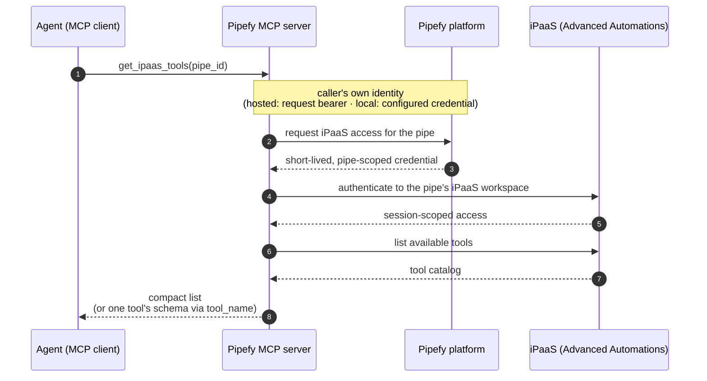

# iPaaS (Advanced Automations) tools

How the MCP server exposes Pipefy's iPaaS (Advanced Automations) capabilities to agents,
starting with the `get_ipaas_tools` meta tool.

## The meta-tool pattern

iPaaS offers a large tool surface. Loading it into every agent session would crowd out
context, so the server exposes it lazily: `get_ipaas_tools(pipe_id)` returns a compact
`name + description` catalog, and `get_ipaas_tools(pipe_id, tool_name=...)` drills into a
single tool's full input schema on demand. Agents pay for the catalog only when they need
it, and for a schema only when they are about to use that tool.

## Flow

Every call is stateless: credentials are minted per request and nothing is cached, so any
server replica can serve any call.

## Configuration

Zero-config by default: the iPaaS base URL and OAuth client id ship with production
defaults — the client is a *public* PKCE client (a publishable identifier, like the
`pipefy-cli` OIDC client; the caller's pipe-scoped session, not the client identity,
carries all authorization). Operators of staging or single-tenant hosts override the URL
and client id (plus a secret for a confidential registration); blanking the client id
disables the iPaaS tools, which then answer with a clear "disabled" error.

## Vocabulary

**iPaaS (a.k.a. Advanced Automations)** — Pipefy's embedded workflow-automation platform
for building flows that connect Pipefy with external apps. Availability is gated **per
organization**, never per pipe.

**iPaaS workspace** — every pipe has its own iPaaS workspace. Flows, connections, and
tool availability are workspace-scoped, therefore pipe-scoped. A flow may *orchestrate
across* many pipes, but it *lives in* (and is only visible from) exactly one pipe's
workspace.

**Authorization** — acting on a pipe's iPaaS workspace requires the caller to be allowed
to create automations on that pipe (a pipe-admin ability), evaluated against the identity
the server resolves for the request. iPaaS-side activity is attributed per pipe.

**Meta tool** — a tool whose job is to expose a catalog of *other* tools on demand (lazy
discovery), so agents load large tool surfaces only when needed. `get_ipaas_tools` is the
first one.
