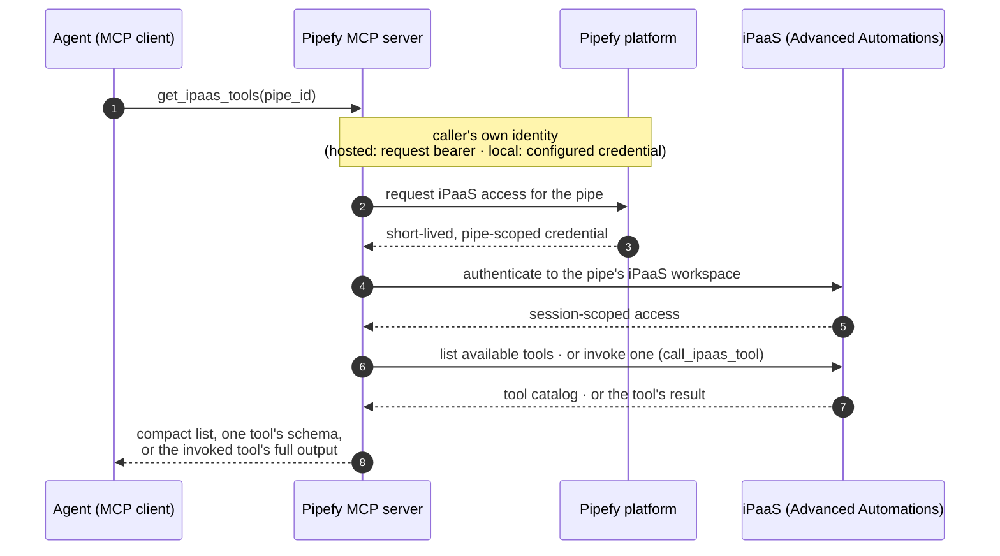

# iPaaS (Advanced Automations) tools

How the MCP server exposes Pipefy's iPaaS (Advanced Automations) capabilities to agents:
`get_ipaas_tools` for discovery, `call_ipaas_tool` for invocation, and
`create_ipaas_connection` / `get_ipaas_connection_auth_url` for connecting the external
apps that flows orchestrate.

## The meta-tool pattern

iPaaS offers a large tool surface. Loading it into every agent session would crowd out
context, so the server exposes it lazily: `get_ipaas_tools(pipe_id)` returns a compact
`name + description` catalog, and `get_ipaas_tools(pipe_id, tool_name=...)` drills into a
single tool's full input schema on demand. Agents pay for the catalog only when they need
it, and for a schema only when they are about to use that tool — then invoke it with
`call_ipaas_tool(pipe_id, tool_name=..., arguments={...})`, which relays the result in
full. The iPaaS host validates the arguments against its own schema, so its error
messages come back verbatim.

## Flow

Every call is stateless: credentials are minted per request and nothing is cached, so any
server replica can serve any call — invocation included. Invocation gets a longer
network budget than discovery, since a called tool may execute a real flow; executions
that outlive it are inspected through the catalog's own run-listing tools.

## Configuration

Zero-config by default: the iPaaS base URL and OAuth client id ship with production
defaults — the client is a *public* PKCE client (a publishable identifier, like the
`pipefy-cli` OIDC client; the caller's pipe-scoped session, not the client identity,
carries all authorization). Operators of staging or single-tenant hosts override the URL
and client id (plus a secret for a confidential registration); blanking the client id
disables the iPaaS tools, which then answer with a clear "disabled" error.

## Vocabulary

**iPaaS (a.k.a. Advanced Automations)** — Pipefy's embedded workflow-automation platform
for building flows that connect Pipefy with external apps. Availability is gated **per
organization**, never per pipe.

**iPaaS workspace** — every pipe has its own iPaaS workspace. Flows, connections, and
tool availability are workspace-scoped, therefore pipe-scoped. A flow may *orchestrate
across* many pipes, but it *lives in* (and is only visible from) exactly one pipe's
workspace.

**Authorization** — acting on a pipe's iPaaS workspace requires the caller to be allowed
to create automations on that pipe (a pipe-admin ability), evaluated against the identity
the server resolves for the request. iPaaS-side activity is attributed per pipe.
Invocation exposes the full catalog — including destructive operations — because the
same caller already has that full surface in the product's Advanced Automations UI; the
MCP path grants nothing beyond it, and `call_ipaas_tool` is annotated destructive so
agent clients apply their approval flows.

**Connection** — an app credential stored in a pipe's iPaaS workspace, referenced by
flow steps that act on that app (by its `external_id`). Token/API-key connections are
created fully in-conversation; OAuth connections take one browser consent from the user,
with the durable tokens exchanged and stored host-side. Secrets can be kept out of the
conversation entirely via `{"$env": "PIPEFY_IPAAS_CONNECTION_<NAME>"}` references
resolved from the MCP server's own environment — only variables under that prefix
resolve, which keeps the tool from being steered into shipping unrelated process
secrets. Creation is an upsert: reusing an `external_id` rotates that connection's
credential.

**Meta tool** — a tool whose job is to expose a catalog of *other* tools on demand (lazy
discovery), so agents load large tool surfaces only when needed. `get_ipaas_tools` is the
first one; `call_ipaas_tool` is its invocation counterpart.
